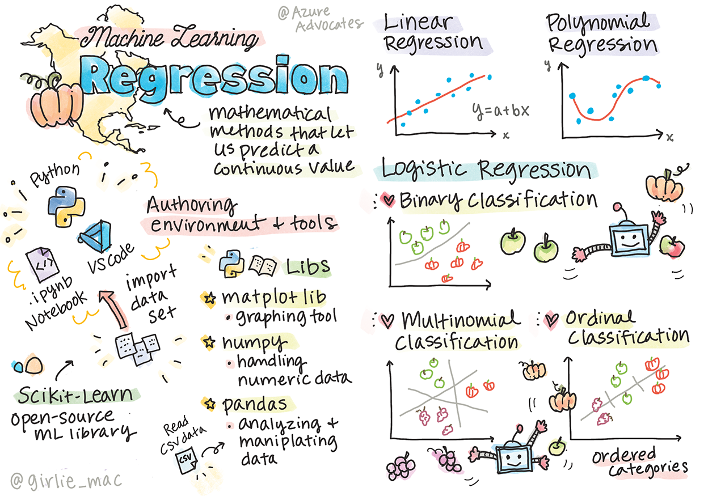

# 回帰モデルについてPythonとScikit-learnから始めましょう



> [Tomomi Imura](https://www.twitter.com/girlie_mac) によって制作されたスケッチノート

## [講義前クイズ](https://jolly-sea-0a877260f.azurestaticapps.net/quiz/9/)

## イントロダクション

この章で用意されている4つのレッスンでは、回帰モデルを構築する方法について学びます。回帰モデルが何をするためのものなのかは、後ほど説明します。しかし、何かを始める前にプロセスを開始するための適切なツールが用意されていることを確認してください！

このレッスンでは、以下のことを学びます。

- ローカル環境で機械学習タスクを実行するための設定
- Jupyter Notebookの使い方
- Scikit-learnのインストールと使い方
- 線形回帰に関するハンズオン

## インストールと設定

[](https://youtu.be/7EXd4_ttIuw "VisualStudioCodeでのPythonの使用方法")

> 🎥 上の画像をクリックするとビデオが再生されます: VisualStudioCodeでのPythonの使用方法

1. **Pythonのインストール**: [Python](https://www.python.org/downloads/) がコンピュータにインストールされていることを確認してください。Pythonは多くのデータサイエンス、機械学習のタスクで使用します。ほとんどのコンピュータシステムにはPythonがすでにインストールされています。一部のユーザのセットアップを簡単にするために [Python Coding Packs](https://code.visualstudio.com/learn/educators/installers?WT.mc_id=academic-15963-cxa) を利用することもできます。

   しかし、Pythonを使っていると時に異なるバージョンを必要とする場合があります。そのため、[仮想環境](https://docs.python.org/3/library/venv.html) を利用すると便利です。   


2. **Visual Studio Codeのインストール**: Visual Studio Codeがコンピュータにインストールされていることを確認してください。[こちらの手順](https://code.visualstudio.com/) でVisual Studio Codeをインストールしてください。このコースでは、Visual Studio CodeでPythonを使用しますので [Visual Studio Codeの設定](https://docs.microsoft.com/learn/modules/python-install-vscode?WT.mc_id=academic-15963-cxa) をブラッシュアップしておくといいです。

   > この [学習モジュール](https://docs.microsoft.com/users/jenlooper-2911/collections/mp1pagggd5qrq7?WT.mc_id=academic-15963-cxa) を利用して、Pythonの使い方に慣れてください。


3. **Scikit-learnのインストール**: [こちらの手順](https://scikit-learn.org/stable/install.html) に従ってインストールしてください。Python3の環境で実行する必要があるので、仮想環境を使用することをおすすめします。なお、このライブラリをM1のMacにインストールする場合は、上記リンク先のページに特別な説明があります。


4. **Jupyter Notebookのインストール**: [Jupyter package](https://pypi.org/project/jupyter/) をインストールする必要があります。

## MLのオーサリング環境

**ノートブック**を利用して、Pythonコードでの開発や機械学習モデルの作成を行います。このような種類のファイルは、データサイエンティストにとって一般的なツールであり、接尾辞または拡張子が `.ipynb` であることで識別できます。

ノートブックは、開発者がコードを書くと同時に、そのコードにメモを加えたり、文書を書いたりすることができるインタラクティブな環境です。そのため、実験や研究を目的としたプロジェクトに非常に役立ちます。

### エクササイズ - ノートブックでの作業

フォルダの中に _notebook.ipynb_ というファイルが入っています。 

1. Visual Studio Codeで _notebook.ipynb_ を開いてください。

   JupyterサーバーはPython3+が起動した状態でスタートします。ノートブックの中には、コードを「実行」できる部分があります。再生ボタンのようなアイコンを選択すると、コードブロックを実行することができます。


2. `md`アイコンを選択して、**# Welcome to your notebook** というテキストの簡単なマークダウンを追加してみましょう.

   次に、Pythonのコードを追加します。


3. コードブロックで **print('hello notebook')** と入力してください。
   

4. 矢印を選択するとコードが実行されます。

   以下のような結果が出力されます:

    ```output
    hello notebook
    ```


コードにコメントを追加することで、ノートブックをセルフドキュメント化することができます。

✅ ウェブ開発者とデータサイエンティストの開発環境がどれほど違うか、ちょっと考えてみてください。

## Scikit-learnを使ってみましょう

さて、ローカル環境にPythonがセットアップされ、Jupyter notebookに慣れてきたところで、Scikit-learn（「science」のように「sci」と発音してください）にも同様に慣れていきましょう。Scikit-learnは、MLタスクを実行するための [広範なAPI](https://scikit-learn.org/stable/modules/classes.html#api-ref) を提供しています。

同社の [Webサイト](https://scikit-learn.org/stable/getting_started.html) には次のような説明があります。"Scikit-learnは、教師あり、教師なしの学習をサポートするオープンソースの機械学習ライブラリです。また、モデルのフィッティング、データの前処理、モデルの選択と評価、その他多くのユーティリティーのための様々なツールを提供しています。"

このコースでは、Scikit-learnやその他のツールを使って機械学習モデルを構築し、私たちが「伝統的な機械学習」と呼ぶタスクを実行します。ニューラルネットワークやディープラーニングについては、近日公開予定の「AI for Beginners」カリキュラムで詳しく解説しますので、意図的に避けています。

Scikit-learnは、モデルを構築し、評価を行って実際に利用するということが簡単にできます。主に数値データの使用に焦点を当てており、学習ツールとして使用するための既製のデータセットがいくつか含まれています。また、事前に構築済みのモデルもいくつか含まれています。では、Scikit-learnであらかじめ用意されているデータを使って、最初のMLモデルを構築するプロセスを体験しましょう。

## エクササイズ - 初めてのScikit-learnノートブック

> このチュートリアルはScikit-learnのWebサイトに掲載されている [linear regression example](https://scikit-learn.org/stable/auto_examples/linear_model/plot_ols.html#sphx-glr-auto-examples-linear-model-plot-ols-py) を参考にしています。

このレッスンに関連する _notebook.ipynb_ ファイルで、「ゴミ箱」アイコンを押して全てのセルを消去します。

このセクションでは、学習用にScikit-learnに組み込まれた、糖尿病に関する小さなデータセットを扱います。糖尿病患者の治療法をテストしたい場合を想像してみてください。機械学習モデルは、変数の組み合わせに基づいて、どの患者がその治療法によく反応するかを判断するのに役立つかもしれません。非常に基本的な回帰モデルであっても、視覚化することで、理論的な臨床試験を整理するのに役立つ変数に関する情報が得られるかもしれません。

✅ 回帰には様々な種類があり、求める答えによってどの手法を選ぶかが異なります。例えば、ある人の年齢が与えられて身長を予測したい場合には、**数値**を求めたいので線形回帰を利用します。ある種類の料理がビーガンとみなされるべきかどうかを発見することに興味がある場合は、**カテゴリーの割り当て**を求めているので、ロジスティック回帰を使用するでしょう。ロジスティック回帰については後ほど詳しく説明します。いくつかのデータについて、どのような手法がより適切であるかを少し考えてみてください。

では、今回のタスクに取り掛かりましょう。

### ライブラリのインポート

このタスクでは、いくつかのライブラリをインポートします。

- **matplotlib**: 便利な [グラフ作成ツール](https://matplotlib.org/) です。今回はこれを使って折れ線グラフを作成します。
- **numpy**: [numpy](https://numpy.org/doc/stable/user/whatisnumpy.html) はPythonで数値データを扱うための便利なライブラリです。
- **sklearn**: Scikit-learnのライブラリです。

作業に役立つライブラリをいくつか紹介します。

1. 以下のコードを入力してインポートを追加します。

   ```python
   import matplotlib.pyplot as plt
   import numpy as np
   from sklearn import datasets, linear_model, model_selection
   ```

   上記では、`matplottlib`と`numpy`をインポートし、`sklearn`から`datasets`、`linear_model`、`model_selection`をインポートしています。`model_selection`はデータをトレーニングセットとテストセットに分割する際に使用します。

### 糖尿病のデータセット

組み込みの [diabetes dataset](https://scikit-learn.org/stable/datasets/toy_dataset.html#diabetes-dataset) には、糖尿病に関する442サンプルのデータが含まれており、10個の変数が含まれています。

age: 年齢
bmi: ボディマス指数
bp: 平均血圧
s1 tc: T細胞（白血球の一種）

✅ このデータセットには、糖尿病に関する研究に重要な変数として「性別」の概念が含まれています。多くの医療データセットには、このようなバイナリ分類が含まれています。このような分類が、人口のある部分を治療から排除する可能性があることについて、少し考えてみましょう。

では、Xとyのデータを読み込みます。

> 🎓 今回は教師あり学習なので、「y」で表されるターゲットが必要なことを覚えておいてください。

新しいコードセルで、`load_diabetes()` を呼び出して糖尿病データセットを読み込みます。入力の `return_X_y=True` は、`X` がデータ行列であり、`y` が回帰の対象であることを示しています。

1. データ行列の形とその最初の要素を表示するために、いくつかのprintコマンドを追加します。

    ```python
    X, y = datasets.load_diabetes(return_X_y=True)
    print(X.shape)
    print(X[0])
    ```

   `load_diabetes()` のレスポンスとしてタプルが返ってきます。タプルの2つの値をそれぞれ `X`と` y`に割り当てます。詳しくは、 [タプルについて](https://wikipedia.org/wiki/Tuple) を確認してください。  

    このデータは、442個のアイテムで構成されており、一つのアイテムは10個の要素を持つ配列であることがわかります。

    ```text
    (442, 10)
    [ 0.03807591  0.05068012  0.06169621  0.02187235 -0.0442235  -0.03482076
    -0.04340085 -0.00259226  0.01990842 -0.01764613]
    ```

    ✅ データと回帰対象の関係について少し考えてみましょう。線形回帰では、特徴量Xとターゲット変数yの関係を予測します。ドキュメントで、糖尿病データセットの [ターゲット](https://scikit-learn.org/stable/datasets/toy_dataset.html#diabetes-dataset) を見つけることができますか？そのターゲットを踏まえて、このデータセットは何を示していますか？
   

2. 次に、numpyの`newaxis`関数を使って新しい配列を作成することで、プロットするためのデータセットの一部を選択します。最終的には線形回帰を使用することで、決まったパターンに従って、このデータの値の間に線を生成します。

   ```python
   X = X[:, np.newaxis, 2]
   ```

   ✅ いつでも、データをprintして、その形を確認することができます。


3. データをプロットする準備ができたので、このデータセットの数字の論理的な分割を機械が判断できるかどうかを確認してみましょう。そのためには、データ(X)とターゲット(y)の両方をトレーニングセットとテストセットに分ける必要があります。Scikit-learnには、これを行うための簡単な方法が用意されています。
   
   ```python
   X_train, X_test, y_train, y_test = model_selection.train_test_split(X, y, test_size=0.33)
   ```


4. これで、モデルをトレーニングする準備が整いました！線形回帰モデルを読み込み、Xとyのトレーニングセットに `model.fit()` を適用して、モデルの学習を行います。
   
    ```python
    model = linear_model.LinearRegression()
    model.fit(X_train, y_train)
    ```

    ✅ `model.fit()` は、TensorFlowなどのMLライブラリでよく見かける関数です。


5. 次に、`predict()` 関数を使って、テストデータに対する予測を行います。これは、データグループ間の線を引くために使用されます。

    ```python
    y_pred = model.predict(X_test)
    ```

6. さて、いよいよデータをプロットして表示してみましょう。Matplotlibはこの作業にとても便利なツールです。テストデータの全てのXとyに関する散布図を作成し、モデルの予測を使用することでデータグループ間の最も適切な場所に線を引きます。

    ```python
    plt.scatter(X_test, y_test,  color='black')
    plt.plot(X_test, y_pred, color='blue', linewidth=3)
    plt.show()
    ```

   

   ✅ ここで何が起こっているのか、少し考えてみましょう。直線がたくさんの小さなデータの点を通っていますが、正確には何をしているのでしょうか？この直線を使って、見たことのない新しいデータポイントがプロットのy軸との関係でどこに当てはまるかを予測することができるはずだということがわかりますか？このモデルの実用的な使い方を言葉にしてみてください。

おめでとうございます！初めて線形回帰モデルを構築し、それを使って予測を行い、結果をプロットで表示しました！

---
## 🚀チャレンジ

このデータセットから別の変数を選択してプロットしてください。ヒント： `X = X[:, np.newaxis, 2]` の行を編集する。今回のデータセットのターゲットである、糖尿病という病気の進行について、どのような発見があるのでしょうか？
## [講義後クイズ](https://jolly-sea-0a877260f.azurestaticapps.net/quiz/10/)

## レビュー & 自主学習

このチュートリアルでは、単変量線形回帰や多変量線形回帰ではなく、単純線形回帰を扱いました。これらの手法の違いについて少し調べてみるか、この [ビデオ](https://www.coursera.org/lecture/quantifying-relationships-regression-models/linear-vs-nonlinear-categorical-variables-ai2Ef) を見てみましょう。

回帰の概念について詳しく調べ、この手法でどのような質問に答えられるかを考えてみましょう。この [チュートリアル](https://docs.microsoft.com/learn/modules/train-evaluate-regression-models?WT.mc_id=academic-15963-cxa) で理解を深めることもできます。

## 課題

[異なるデータセット](../assignment.md)
