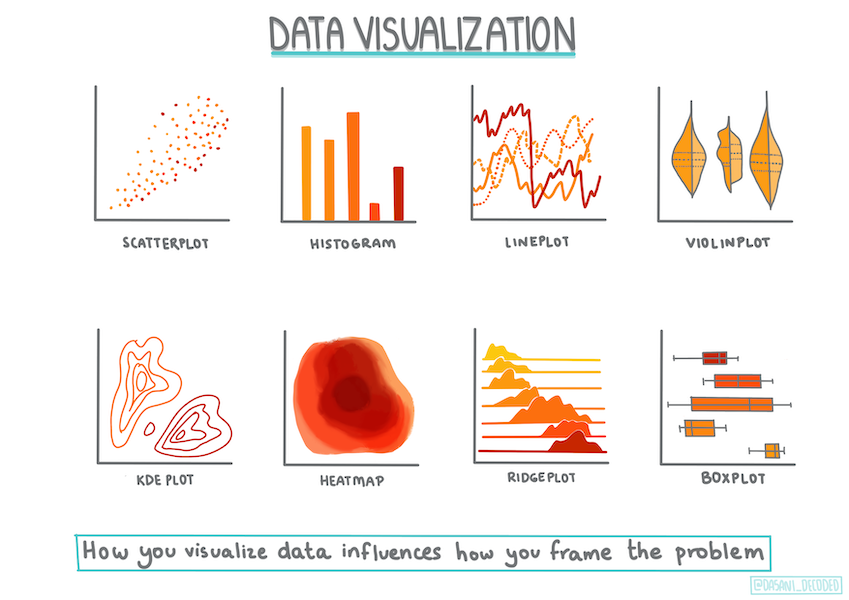
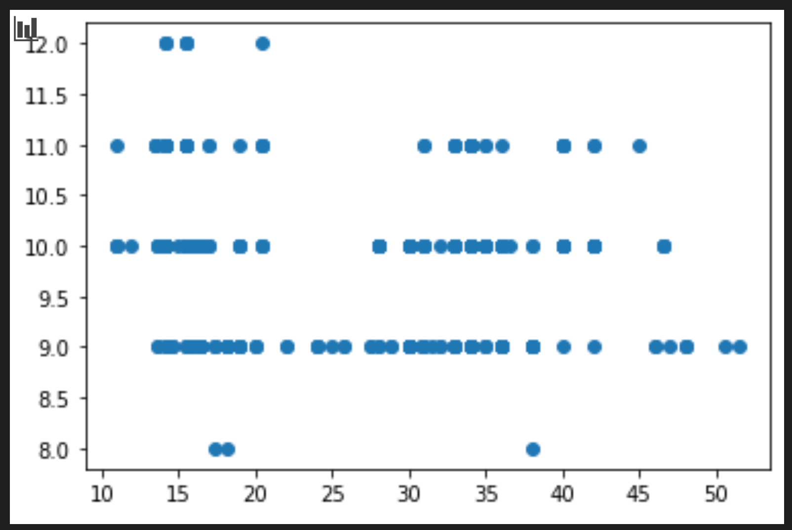

# 使用 Scikit-learn 構建回歸模型：準備和可視化數據


> 作者 [Dasani Madipalli](https://twitter.com/dasani_decoded)

## [課前測](https://white-water-09ec41f0f.azurestaticapps.net/quiz/11/)

## 介紹

既然你已經設置了開始使用 Scikit-learn 處理機器學習模型構建所需的工具，你就可以開始對數據提出問題了。當你處理數據並應用ML解決方案時，了解如何提出正確的問題以正確釋放數據集的潛力非常重要。

在本課中，你將學習：

- 如何為模型構建準備數據。
- 如何使用 Matplotlib 進行數據可視化。

## 對你的數據提出正確的問題

你提出的問題將決定你將使用哪種類型的 ML 算法。你得到的答案的質量將在很大程度上取決於你的數據的性質。

查看為本課程提供的[數據](../data/US-pumpkins.csv)。你可以在 VS Code 中打開這個 .csv 文件。快速瀏覽一下就會發現有空格，還有字符串和數字數據的混合。還有一個奇怪的列叫做「Package」，其中的數據是「sacks」、「bins」和其他值的混合。事實上，數據有點亂。

事實上，得到一個完全準備好用於創建 ML 模型的開箱即用數據集並不是很常見。在本課中，你將學習如何使用標準 Python 庫準備原始數據集。你還將學習各種技術來可視化數據。

## 案例研究：「南瓜市場」

你將在 `data` 文件夾中找到一個名為 [US-pumpkins.csv](../data/US-pumpkins.csv) 的 .csv 文件，其中包含有關南瓜市場的 1757 行數據，已按城市排序分組。這是從美國農業部分發的[特種作物終端市場標準報告](https://www.marketnews.usda.gov/mnp/fv-report-config-step1?type=termPrice)中提取的原始數據。

### 準備數據

這些數據屬於公共領域。它可以從美國農業部網站下載，每個城市有許多不同的文件。為了避免太多單獨的文件，我們將所有城市數據合並到一個電子表格中，因此我們已經準備了一些數據。接下來，讓我們仔細看看數據。

### 南瓜數據 - 早期結論

你對這些數據有什麽看法？你已經看到了無法理解的字符串、數字、空格和奇怪值的混合體。

你可以使用回歸技術對這些數據提出什麽問題？「預測給定月份內待售南瓜的價格」怎麽樣？再次查看數據，你需要進行一些更改才能創建任務所需的數據結構。

## 練習 - 分析南瓜數據

讓我們使用 [Pandas](https://pandas.pydata.org/)，（「Python 數據分析」 Python Data Analysis 的意思）一個非常有用的工具，用於分析和準備南瓜數據。

### 首先，檢查遺漏的日期

你首先需要采取以下步驟來檢查缺少的日期：

1. 將日期轉換為月份格式（這些是美國日期，因此格式為 `MM/DD/YYYY`）。

2. 將月份提取到新列。

在 Visual Studio Code 中打開 notebook.ipynb 文件，並將電子表格導入到新的 Pandas dataframe 中。

1. 使用 `head()` 函數查看前五行。

    ```python
    import pandas as pd
    pumpkins = pd.read_csv('../../data/US-pumpkins.csv')
    pumpkins.head()
    ```

    ✅ 使用什麽函數來查看最後五行？

2. 檢查當前 dataframe 中是否缺少數據：

    ```python
    pumpkins.isnull().sum()
    ```

    有數據丟失，但可能對手頭的任務來說無關緊要。

3. 為了讓你的 dataframe 更容易使用，使用 `drop()` 刪除它的幾個列，只保留你需要的列：

    ```python
    new_columns = ['Package', 'Month', 'Low Price', 'High Price', 'Date']
    pumpkins = pumpkins.drop([c for c in pumpkins.columns if c not in new_columns], axis=1)
    ```

### 然後，確定南瓜的平均價格

考慮如何確定給定月份南瓜的平均價格。你會為此任務選擇哪些列？提示：你需要 3 列。

解決方案：取 `Low Price` 和 `High Price` 列的平均值來填充新的 Price 列，將 Date 列轉換成只顯示月份。幸運的是，根據上面的檢查，沒有丟失日期或價格的數據。

1. 要計算平均值，請添加以下代碼：

    ```python
    price = (pumpkins['Low Price'] + pumpkins['High Price']) / 2
    
    month = pd.DatetimeIndex(pumpkins['Date']).month
    
    ```

   ✅ 請隨意使用 `print(month)` 打印你想檢查的任何數據。

2. 現在，將轉換後的數據復製到新的 Pandas dataframe 中：

    ```python
    new_pumpkins = pd.DataFrame({'Month': month, 'Package': pumpkins['Package'], 'Low Price': pumpkins['Low Price'],'High Price': pumpkins['High Price'], 'Price': price})
    ```

    打印出的 dataframe 將向你展示一個幹凈整潔的數據集，你可以在此數據集上構建新的回歸模型。

### 但是等等！這裏有點奇怪

如果你看看 `Package`(包裝)一欄，南瓜有很多不同的配置。有的以 1 1/9 蒲式耳的尺寸出售，有的以 1/2 蒲式耳的尺寸出售，有的以每只南瓜出售，有的以每磅出售，有的以不同寬度的大盒子出售。

> 南瓜似乎很難統一稱重方式

深入研究原始數據，有趣的是，任何 `Unit of Sale` 等於「EACH」或「PER BIN」的東西也具有每英寸、每箱或「每個」的 `Package` 類型。南瓜似乎很難采用統一稱重方式，因此讓我們通過僅選擇 `Package` 列中帶有字符串「蒲式耳」的南瓜來過濾它們。

1. 在初始 .csv 導入下添加過濾器：

    ```python
    pumpkins = pumpkins[pumpkins['Package'].str.contains('bushel', case=True, regex=True)]
    ```

    如果你現在打印數據，你可以看到你只獲得了 415 行左右包含按蒲式耳計算的南瓜的數據。

### 可是等等！ 還有一件事要做

你是否註意到每行的蒲式耳數量不同？你需要對定價進行標準化，以便顯示每蒲式耳的定價，因此請進行一些數學計算以對其進行標準化。

1. 在創建 new_pumpkins dataframe 的代碼塊之後添加這些行：

    ```python
    new_pumpkins.loc[new_pumpkins['Package'].str.contains('1 1/9'), 'Price'] = price/(1 + 1/9)
    
    new_pumpkins.loc[new_pumpkins['Package'].str.contains('1/2'), 'Price'] = price/(1/2)
    ```

✅ 根據 [The Spruce Eats](https://www.thespruceeats.com/how-much-is-a-bushel-1389308)，蒲式耳的重量取決於產品的類型，因為它是一種體積測量。「例如，一蒲式耳西紅柿應該重56 磅……葉子和蔬菜占據更多空間，重量更輕，所以一蒲式耳菠菜只有20磅。」 這一切都相當復雜！讓我們不要費心進行蒲式耳到磅的轉換，而是按蒲式耳定價。然而，所有這些對蒲式耳南瓜的研究表明，了解數據的性質是多麽重要！

現在，你可以根據蒲式耳測量來分析每單位的定價。如果你再打印一次數據，你可以看到它是如何標準化的。

✅ 你有沒有註意到半蒲式耳賣的南瓜很貴？你能弄清楚為什麽嗎？提示：小南瓜比大南瓜貴得多，這可能是因為考慮到一個大的空心餡餅南瓜占用的未使用空間，每蒲式耳的南瓜要多得多。

## 可視化策略

數據科學家的部分職責是展示他們使用的數據的質量和性質。為此，他們通常會創建有趣的可視化或繪圖、圖形和圖表，以顯示數據的不同方面。通過這種方式，他們能夠直觀地展示難以發現的關系和差距。

可視化還可以幫助確定最適合數據的機器學習技術。例如，似乎沿著一條線的散點圖表明該數據是線性回歸練習的良好候選者。

一個在 Jupyter notebooks 中運行良好的數據可視化庫是 [Matplotlib](https://matplotlib.org/)（你在上一課中也看到過）。

> 在[這些教程](https://docs.microsoft.com/learn/modules/explore-analyze-data-with-python?WT.mc_id=academic-15963-cxa)中獲得更多數據可視化經驗。

## 練習 - 使用 Matplotlib 進行實驗

嘗試創建一些基本圖形來顯示你剛剛創建的新 dataframe。基本線圖會顯示什麽？

1. 在文件頂部導入 Matplotlib：

    ```python
    import matplotlib.pyplot as plt
    ```

2. 重新刷新以運行整個 notebook。

3. 在 notebook 底部，添加一個單元格以繪製數據：

    ```python
    price = new_pumpkins.Price
    month = new_pumpkins.Month
    plt.scatter(price, month)
    plt.show()
    ```

    

    這是一個有用的圖嗎？有什麽讓你吃驚的嗎？

    它並不是特別有用，因為它所做的只是在你的數據中顯示為給定月份的點數分布。

### 讓它有用

為了讓圖表顯示有用的數據，你通常需要以某種方式對數據進行分組。讓我們嘗試創建一個圖，其中 y 軸顯示月份，數據顯示數據的分布。

1. 添加單元格以創建分組柱狀圖：

    ```python
    new_pumpkins.groupby(['Month'])['Price'].mean().plot(kind='bar')
    plt.ylabel("Pumpkin Price")
    ```

    

    這是一個更有用的數據可視化！似乎表明南瓜的最高價格出現在 9 月和 10 月。這符合你的期望嗎？為什麽？為什麽不？

---

## 🚀挑戰

探索 Matplotlib 提供的不同類型的可視化。哪種類型最適合回歸問題？

## [課後測](https://white-water-09ec41f0f.azurestaticapps.net/quiz/12/)

## 復習與自學

請看一下可視化數據的多種方法。列出各種可用的庫，並註意哪些庫最適合給定類型的任務，例如 2D 可視化與 3D 可視化。你發現了什麽？

## 任務

[探索可視化](./assignment.zh-tw.md)
