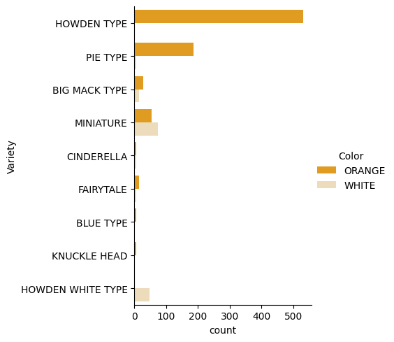
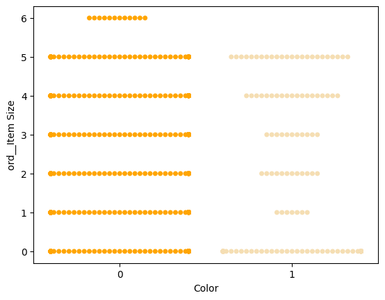
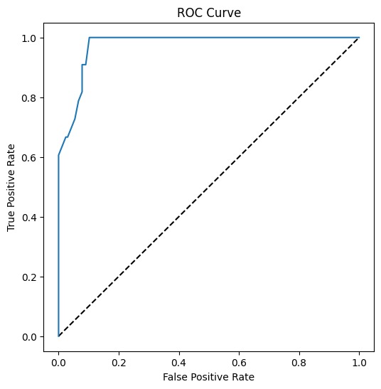

# Logistic regression to predict categories


> Infographic by [Dasani Madipalli](https://twitter.com/dasani_decoded)
## [Pre-lecture quiz](https://gray-sand-07a10f403.1.azurestaticapps.net/quiz/15/)

> ### [This lesson is available in R!](./solution/R/lesson_4-R.ipynb)

## Introduction

In this final lesson on Regression, one of the basic _classic_ ML techniques, we will take a look at Logistic Regression. You would use this technique to discover patterns to predict binary categories. Is this candy chocolate or not? Is this disease contagious or not? Will this customer choose this product or not? 

In this lesson, you will learn:

- A new library for data visualization
- Techniques for logistic regression

✅ Deepen your understanding of working with this type of regression in this [Learn module](https://docs.microsoft.com/learn/modules/train-evaluate-classification-models?WT.mc_id=academic-77952-leestott)
## Prerequisite

Having worked with the pumpkin data, we are now familiar enough with it to realize that there's one binary category that we can work with: `Color`.

Let's build a logistic regression model to predict that, given some variables, _what color a given pumpkin is likely to be_ (orange 🎃 or white 👻).

> Why are we talking about binary classification in a lesson grouping about regression? Only for linguistic convenience, as logistic regression is [really a classification method](https://scikit-learn.org/stable/modules/linear_model.html#logistic-regression), albeit a linear-based one. Learn about other ways to classify data in the next lesson group.

## Define the question

For our purposes, we will express this as a binary: 'White' or 'Not White'. There is also a 'striped' category in our dataset but there are few instances of it, so we will not use it. It disappears once we remove null values from the dataset, anyway.

> 🎃 Fun fact, we sometimes call white pumpkins 'ghost' pumpkins. They aren't very easy to carve, so they aren't as popular as the orange ones but they are cool looking! So we could also reformulate our question as: 'Ghost' or 'Not Ghost'. 👻

## About logistic regression

Logistic regression differs from linear regression, which you learned about previously, in a few important ways.

### Binary classification

Logistic regression does not offer the same features as linear regression. The former offers a prediction about a binary category ("orange or not orange") whereas the latter is capable of predicting continual values, for example given the origin of a pumpkin and the time of harvest, _how much its price will rise_.


> Infographic by [Dasani Madipalli](https://twitter.com/dasani_decoded)
### Other classifications

There are other types of logistic regression, including multinomial and ordinal:

- **Multinomial**, which involves having more than one category - "Orange, White, and Striped".
- **Ordinal**, which involves ordered categories, useful if we wanted to order our outcomes logically, like our pumpkins that are ordered by a finite number of sizes (mini,sm,med,lg,xl,xxl).


> Infographic by [Dasani Madipalli](https://twitter.com/dasani_decoded)

### Variables DO NOT have to correlate

Remember how linear regression worked better with more correlated variables? Logistic regression is the opposite - the variables don't have to align. That works for this data which has somewhat weak correlations.

### You need a lot of clean data

Logistic regression will give more accurate results if you use more data; our small dataset is not optimal for this task, so keep that in mind.

✅ Think about the types of data that would lend themselves well to logistic regression

## Exercise - tidy the data

First, clean the data a bit, dropping null values and selecting only some of the columns:

1. Add the following code:

    ```python
  
    columns_to_select = ['City Name','Package','Variety', 'Origin','Item Size', 'Color']
    pumpkins = full_pumpkins.loc[:, columns_to_select]

    pumpkins.dropna(inplace=True)
    ```

    You can always take a peek at your new dataframe:

    ```python
    pumpkins.info
    ```

### Visualization - categorical plot

By now you have loaded up the [starter notebook](./notebook.ipynb) with pumpkin data once again and cleaned it so as to preserve a dataset containing a few variables, including `Color`. Let's visualize the dataframe in the notebook using a different library: [Seaborn](https://seaborn.pydata.org/index.html), which is built on Matplotlib which we used earlier. 

Seaborn offers some neat ways to visualize your data. For example, you can compare distributions of the data for each `Variety` and `Color` in a categorical plot.

1. Create such a plot by using the `catplot` function, using our pumpkin data `pumpkins`, and specifying a color mapping for each pumpkin category (orange or white):

    ```python
    import seaborn as sns
    
    palette = {
    'ORANGE': 'orange',
    'WHITE': 'wheat',
    }

    sns.catplot(
    data=pumpkins, y="Variety", hue="Color", kind="count",
    palette=palette, 
    )
    ```

    

    By observing the data, you can see how the Color data relates to Variety.

    ✅ Given this categorical plot, what are some interesting explorations you can envision?

### Data pre-processing: feature and label encoding
Our pumpkins dataset contains string values for all its columns. Working with categorical data is intuitive for humans but not for machines. Machine learning algorithms work well with numbers. There's why encoding is a very important step in the data pre-processing phase, since it enables to turn categorical data into numerical data, without losing any information. A good encoding leads to build a good model.

For feature encoding there are two main types of encoders:

1. Ordinal encoder: it suits well for ordinal variables, which are categorical variables where their data follows a logical ordering, like the `Item Size` column in our dataset. It creates a mapping such that each category is represented by a number, which is the order of the category in the column.

    ```python
    from sklearn.preprocessing import OrdinalEncoder

    item_size_categories = [['sml', 'med', 'med-lge', 'lge', 'xlge', 'jbo', 'exjbo']]
    ordinal_features = ['Item Size']
    ordinal_encoder = OrdinalEncoder(categories=item_size_categories)
    ```

2. Categorical encoder: it suits well for nominal variables, which are categorical variables where their data does not follow a logical ordering, like all the features different from `Item Size` in our dataset. It is a one-hot encoding, which means that each category is represented by a binary column: the encoded variable is equal to 1 if the pumpkin belongs to that Variety and 0 otherwise.

    ```python
    from sklearn.preprocessing import OneHotEncoder

    categorical_features = ['City Name', 'Package', 'Variety', 'Origin']
    categorical_encoder = OneHotEncoder(sparse_output=False)
    ```
Then, `ColumnTransformer` is used to combine multiple encoders into a single step and apply them to the appropriate columns.

```python
    from sklearn.compose import ColumnTransformer
    
    ct = ColumnTransformer(transformers=[
        ('ord', ordinal_encoder, ordinal_features),
        ('cat', categorical_encoder, categorical_features)
        ])
    
    ct.set_output(transform='pandas')
    encoded_features = ct.fit_transform(pumpkins)
```
On the other hand, to encode the label, we use the scikit-learn `LabelEncoder` class, which is a utility class to help normalize labels such that they contain only values between 0 and n_classes-1 (here, 0 and 1).

```python
    from sklearn.preprocessing import LabelEncoder

    label_encoder = LabelEncoder()
    encoded_label = label_encoder.fit_transform(pumpkins['Color'])
```
Once we have encoded the features and the label, we can merge them into a new dataframe `encoded_pumpkins`.

```python
    encoded_pumpkins = encoded_features.assign(Color=encoded_label)
```
✅ What are the advantages of using an ordinal encoder for the `Item Size` column?

### Analyse relationships between variables

Now that we have pre-processed our data, we can analyse the relationships between the features and the label to grasp an idea of how well the model will be able to predict the label given the features.
The best way to perform this kind of analysis is plotting the data. We'll be using again the Seaborn `catplot` function, to visualize the relationships between `Item Size`,  `Variety` and `Color` in a categorical plot. To better plot the data we'll be using the encoded `Item Size` column and the unencoded `Variety` column.

```python
    palette = {
    'ORANGE': 'orange',
    'WHITE': 'wheat',
    }
    pumpkins['Item Size'] = encoded_pumpkins['ord__Item Size']

    g = sns.catplot(
        data=pumpkins,
        x="Item Size", y="Color", row='Variety',
        kind="box", orient="h",
        sharex=False, margin_titles=True,
        height=1.8, aspect=4, palette=palette,
    )
    g.set(xlabel="Item Size", ylabel="").set(xlim=(0,6))
    g.set_titles(row_template="{row_name}")
```


### Use a swarm plot

Since Color is a binary category (White or Not), it needs 'a [specialized approach](https://seaborn.pydata.org/tutorial/categorical.html?highlight=bar) to visualization'. There are other ways to visualize the relationship of this category with other variables. 

You can visualize variables side-by-side with Seaborn plots.

1. Try a 'swarm' plot to show the distribution of values:

    ```python
    palette = {
    0: 'orange',
    1: 'wheat'
    }
    sns.swarmplot(x="Color", y="ord__Item Size", data=encoded_pumpkins, palette=palette)
    ```

    


> **🧮 Show Me The Math**
>
> Logistic regression relies on the concept of 'maximum likelihood' using [sigmoid functions](https://wikipedia.org/wiki/Sigmoid_function). A 'Sigmoid Function' on a plot looks like an 'S' shape. It takes a value and maps it to somewhere between 0 and 1. Its curve is also called a 'logistic curve'. Its formula looks like this:
>
> 
>
> where the sigmoid's midpoint finds itself at x's 0 point, L is the curve's maximum value, and k is the curve's steepness. If the outcome of the function is more than 0.5, the label in question will be given the class '1' of the binary choice. If not, it will be classified as '0'.

## Build your model

Building a model to find these binary classification is surprisingly straightforward in Scikit-learn.

1. Select the variables you want to use in your classification model and split the training and test sets calling `train_test_split()`:

    ```python
    from sklearn.model_selection import train_test_split
    
    X = encoded_pumpkins[encoded_pumpkins.columns.difference(['Color'])]
    y = encoded_pumpkins['Color']

    X_train, X_test, y_train, y_test = train_test_split(X, y, test_size=0.2, random_state=0)
    
    ```

2. Now you can train your model, by calling `fit()` with your training data, and print out its result:

    ```python
    from sklearn.metrics import f1_score, classification_report 
    from sklearn.linear_model import LogisticRegression

    model = LogisticRegression()
    model.fit(X_train, y_train)
    predictions = model.predict(X_test)

    print(classification_report(y_test, predictions))
    print('Predicted labels: ', predictions)
    print('F1-score: ', f1_score(y_test, predictions))
    ```

    Take a look at your model's scoreboard. It's not bad, considering you have only about 1000 rows of data:

    ```output
                       precision    recall  f1-score   support
    
                    0       0.94      0.98      0.96       166
                    1       0.85      0.67      0.75        33
    
        accuracy                                0.92       199
        macro avg           0.89      0.82      0.85       199
        weighted avg        0.92      0.92      0.92       199
    
        Predicted labels:  [0 0 0 0 0 0 0 0 0 0 0 0 0 0 0 0 0 0 0 0 1 0 0 1 0 0 0 0 0 0 0 0 1 0 0 0 0
        0 0 0 0 0 1 0 1 0 0 1 0 0 0 0 0 1 0 1 0 1 0 1 0 0 0 0 0 0 0 0 0 0 0 0 0 0
        1 0 0 0 0 0 0 0 1 0 0 0 0 0 0 0 1 0 0 0 0 0 0 0 0 1 0 1 0 0 0 0 0 0 0 1 0
        0 0 0 0 0 0 0 0 0 0 0 0 0 0 0 0 0 0 0 0 0 1 0 0 0 0 0 0 0 0 1 0 0 0 1 1 0
        0 0 0 0 1 0 0 0 0 0 1 0 0 0 0 0 0 0 0 0 0 0 0 0 0 0 0 0 0 0 0 0 0 0 0 0 1
        0 0 0 1 0 0 0 0 0 0 0 0 1 1]
        F1-score:  0.7457627118644068
    ```

## Better comprehension via a confusion matrix

While you can get a scoreboard report [terms](https://scikit-learn.org/stable/modules/generated/sklearn.metrics.classification_report.html?highlight=classification_report#sklearn.metrics.classification_report) by printing out the items above, you might be able to understand your model more easily by using a [confusion matrix](https://scikit-learn.org/stable/modules/model_evaluation.html#confusion-matrix) to help us understand how the model is performing.

> 🎓 A '[confusion matrix](https://wikipedia.org/wiki/Confusion_matrix)' (or 'error matrix') is a table that expresses your model's true vs. false positives and negatives, thus gauging the accuracy of predictions.

1. To use a confusion metrics, call `confusion_matrix()`:

    ```python
    from sklearn.metrics import confusion_matrix
    confusion_matrix(y_test, predictions)
    ```

    Take a look at your model's confusion matrix:

    ```output
    array([[162,   4],
           [ 11,  22]])
    ```

In Scikit-learn, confusion matrices Rows (axis 0) are actual labels and columns (axis 1) are predicted labels.

|       |   0   |   1   |
| :---: | :---: | :---: |
|   0   |  TN   |  FP   |
|   1   |  FN   |  TP   |

What's going on here? Let's say our model is asked to classify pumpkins between two binary categories, category 'white' and category 'not-white'.

- If your model predicts a pumpkin as not white and it belongs to category 'not-white' in reality we call it a true negative, shown by the top left number.
- If your model predicts a pumpkin as white and it belongs to category 'not-white' in reality we call it a false negative, shown by the bottom left number. 
- If your model predicts a pumpkin as not white and it belongs to category 'white' in reality we call it a false positive, shown by the top right number. 
- If your model predicts a pumpkin as white and it belongs to category 'white' in reality we call it a true positive, shown by the bottom right number.

As you might have guessed it's preferable to have a larger number of true positives and true negatives and a lower number of false positives and false negatives, which implies that the model performs better.

How does the confusion matrix relate to precision and recall? Remember, the classification report printed above showed precision (0.85) and recall (0.67).

Precision = tp / (tp + fp) = 22 / (22 + 4) = 0.8461538461538461

Recall = tp / (tp + fn) = 22 / (22 + 11) = 0.6666666666666666

✅ Q: According to the confusion matrix, how did the model do? A: Not bad; there are a good number of true negatives but also a few false negatives. 

Let's revisit the terms we saw earlier with the help of the confusion matrix's mapping of TP/TN and FP/FN:

🎓 Precision: TP/(TP + FP) The fraction of relevant instances among the retrieved instances (e.g. which labels were well-labeled)

🎓 Recall: TP/(TP + FN) The fraction of relevant instances that were retrieved, whether well-labeled or not

🎓 f1-score: (2 * precision * recall)/(precision + recall) A weighted average of the precision and recall, with best being 1 and worst being 0

🎓 Support: The number of occurrences of each label retrieved

🎓 Accuracy: (TP + TN)/(TP + TN + FP + FN) The percentage of labels predicted accurately for a sample.

🎓 Macro Avg: The calculation of the unweighted mean metrics for each label, not taking label imbalance into account.

🎓 Weighted Avg: The calculation of the mean metrics for each label, taking label imbalance into account by weighting them by their support (the number of true instances for each label).

✅ Can you think which metric you should watch if you want your model to reduce the number of false negatives?

## Visualize the ROC curve of this model

Let's do one more visualization to see the so-called 'ROC' curve:

```python
from sklearn.metrics import roc_curve, roc_auc_score
import matplotlib
import matplotlib.pyplot as plt
%matplotlib inline

y_scores = model.predict_proba(X_test)
fpr, tpr, thresholds = roc_curve(y_test, y_scores[:,1])

fig = plt.figure(figsize=(6, 6))
plt.plot([0, 1], [0, 1], 'k--')
plt.plot(fpr, tpr)
plt.xlabel('False Positive Rate')
plt.ylabel('True Positive Rate')
plt.title('ROC Curve')
plt.show()
```
Using Matplotlib, plot the model's [Receiving Operating Characteristic](https://scikit-learn.org/stable/auto_examples/model_selection/plot_roc.html?highlight=roc) or ROC. ROC curves are often used to get a view of the output of a classifier in terms of its true vs. false positives. "ROC curves typically feature true positive rate on the Y axis, and false positive rate on the X axis." Thus, the steepness of the curve and the space between the midpoint line and the curve matter: you want a curve that quickly heads up and over the line. In our case, there are false positives to start with, and then the line heads up and over properly:



Finally, use Scikit-learn's [`roc_auc_score` API](https://scikit-learn.org/stable/modules/generated/sklearn.metrics.roc_auc_score.html?highlight=roc_auc#sklearn.metrics.roc_auc_score) to compute the actual 'Area Under the Curve' (AUC):

```python
auc = roc_auc_score(y_test,y_scores[:,1])
print(auc)
```
The result is `0.9749908725812341`. Given that the AUC ranges from 0 to 1, you want a big score, since a model that is 100% correct in its predictions will have an AUC of 1; in this case, the model is _pretty good_. 

In future lessons on classifications, you will learn how to iterate to improve your model's scores. But for now, congratulations! You've completed these regression lessons!

---
## 🚀Challenge

There's a lot more to unpack regarding logistic regression! But the best way to learn is to experiment. Find a dataset that lends itself to this type of analysis and build a model with it. What do you learn? tip: try [Kaggle](https://www.kaggle.com/search?q=logistic+regression+datasets) for interesting datasets.

## [Post-lecture quiz](https://gray-sand-07a10f403.1.azurestaticapps.net/quiz/16/)

## Review & Self Study

Read the first few pages of [this paper from Stanford](https://web.stanford.edu/~jurafsky/slp3/5.pdf) on some practical uses for logistic regression. Think about tasks that are better suited for one or the other type of regression tasks that we have studied up to this point. What would work best?

## Assignment 

[Retrying this regression](assignment.md)
