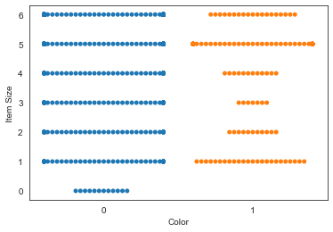
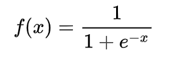

# Logistic Regression to Predict Categories

> Sketchnote on Logistic Regression
## [Pre-lecture quiz](https://jolly-sea-0a877260f.azurestaticapps.net/quiz/11/)

### Introduction

In this final lesson on Regression, one of the basic 'classic' ML techniques, we will take a look at Logistic Regression. You would use this technique to discover patterns to predict binary categories. Is this candy chocolate or not? Is this disease contagious or not? Will this customer choose this product or not? 

In this lesson, you will learn:
- A new library for data visualization
- Techniques for Logistic Regression

Deepen your understanding of working with this type of Regression in this [Learn module](https://docs.microsoft.com/learn/modules/train-evaluate-classification-models?WT.mc_id=academic-15963-cxa)
## Prerequisite

Having worked with the pumpkin data, we are now familiar enough with it to realize that there's one small category that we can work with: Color. Let's build a Logistic Regression model to predict that, given some variables, what color a given pumpkin will be (orange 🎃 or white 👻). 

For our purposes, we will express this as a binary: 'Orange' or 'Not Orange'. There is also a 'striped' category in our dataset but there are few instances of it, so we will not use it. It disappears once we remove null values from the dataset, anyway.

> 🎃 Fun fact, we sometimes call white pumpkins 'ghost' pumpkins. They aren't very easy to carve, so they aren't as popular as the orange ones but they are cool looking!

## About Logistic Regression

Logistic Regression differs from Linear Regression, which you learned about previously, in a few important ways.
### Binary Classification

Logistic Regression does not offer the same features as Linear Regression. The former offers a prediction about a binary category ("orange or not orange") whereas the latter is capable of predicting continual values, for example given the origin of a pumpkin and the time of month, how much its price will rise.
### Other Classifications

There are other types of Logistic Regression, including Multinomial and Ordinal. Multinomial involves having more than one categories - "Orange, White, and Striped". Ordinal involves ordered categories, such as if we wanted to order our outcomes logically, like our pumpkins that are ordered by a finite number of sizes (mini,sm,med,lg,xl,xxl).

### It's Still Linear

Even though this type of Regression is all about category predictions, it still works best when there is a clear linear relationship between the dependent variable (color) and the other independent variables (the rest of the dataset, like city name and size). It's good to get an idea of whether there is any linearity dividing these variables or not.

### Variables DO NOT have to correlate

Remember how Linear Regression worked better with more correlated variables? Logistic Regression is the opposite - the variables don't have to align. That works for this data which has somewhat weak correlations.
### You Need a Lot of Clean Data

Logistic Regression will give more accurate results if you use more data; our small dataset is not optimal for this task, so keep that in mind.

✅ Think about the types of data that would lend themselves well to Logistic Regression

## Tidy the Data

First, clean the data a bit, dropping null values and selecting only some of the columns:

```python
from sklearn.preprocessing import LabelEncoder

new_columns = ['Color','Origin','Item Size','Variety','City Name','Package']

new_pumpkins = pumpkins.drop([c for c in pumpkins.columns if c not in new_columns], axis=1)

new_pumpkins.dropna(inplace=True)

new_pumpkins = new_pumpkins.apply(LabelEncoder().fit_transform)
```

You can always take a peek at your new dataframe:

```python
new_pumpkins.info
```
### Visualization

By now you have loaded up the [starter notebook](./notebook.ipynb) with pumpkin data once again and cleaned it so as to preserve a dataset containing a few variables, including Color. Let's visualize the dataframe in the notebook using a different library: [Seaborn](https://seaborn.pydata.org/index.html), which is built on Matplotlib which we used earlier. Seaborn offers some neat ways to visualize your data. For example, you can compare distributions of the data for each point in a side-by side grid.

```python
import seaborn as sns

g = sns.PairGrid(new_pumpkins)
g.map(sns.scatterplot)
```


By observing data side-by-side, you can see how the Color data relates to the other columns. 

✅ Given this scatterplot grid, what are some interesting explorations you can envision?

Since Color is a binary category (Orange or Not), it's called 'categorical data' and needs 'a more [specialized approach](https://seaborn.pydata.org/tutorial/categorical.html?highlight=bar) to visualization'. There are other ways to visualize the relationship of this category with other variables. You can visualize variables side-by-side with Seaborn plots. Try a 'swarm' plot to show the distribution of values:

```python
sns.swarmplot(x="Color", y="Item Size", data=new_pumpkins)
```



A 'violin' type plot is useful as you can easily visualize the way that data in the two categories is distributed. Violin plots don't work so well with smaller datasets as the distribution is displayed more 'smoothly'.

```python
sns.catplot(x="Color", y="Item Size",
            kind="violin", data=new_pumpkins)
```


✅ Try creating this plot, and other Seaborn plots, using other variables.

Now that we have an idea of the relationship between the binary categories of color and the larger group of sizes, let's explore Logistic Regression to determine a given pumpkin's likely color.

> infographic here

> **🧮 Show Me The Math**
>
> Remember how Linear Regression often used ordinary least squares to arrive at a value? Logistic Regression relies on the concept of 'maximum likelihood' using [sigmoid functions](https://en.wikipedia.org/wiki/Sigmoid_function). A 'Sigmoid Function' on a plot looks like an 'S' shape. It takes a value and maps it to somewhere between 0 and 1. Its curve is also called a 'logistic curve'. Its formula looks like thus:
>
> 
> where the sigmoid's midpoint finds itself at x's 0 point, L is the curve's maximum value, and k is the curve's steepness. If the outcome of the function is more than 0.5, the label in question will be given the class '1' of the binary choice. If not, it will be classified as '0'.

## Build your model

Building a model to find these binary classification is surprisingly straightforward in Scikit-Learn.

Select the variables you want to use in your classification model and split the training and test sets:

```python
from sklearn.model_selection import train_test_split

Selected_features = ['Origin','Item Size','Variety','City Name','Package']

X = new_pumpkins[Selected_features]
y = new_pumpkins['Color']

X_train, X_test, y_train, y_test = train_test_split(X, y, test_size=0.2, random_state=0)

```

Now you can train your model and print out its result:

```python
from sklearn.model_selection import train_test_split
from sklearn.metrics import accuracy_score, classification_report 
from sklearn.linear_model import LogisticRegression

model = LogisticRegression()
model.fit(X_train, y_train)
predictions = fit.predict(X_test)

print(classification_report(y_test, predictions))
print('Predicted labels: ', predictions)
print('Accuracy: ', accuracy_score(y_test, predictions))
```

Take a look at your model's scoreboard. It's not too bad, considering you have only about 1000 rows of data:

```
                   precision    recall  f1-score   support

           0       0.85      0.95      0.90       166
           1       0.38      0.15      0.22        33

    accuracy                           0.82       199
   macro avg       0.62      0.55      0.56       199
weighted avg       0.77      0.82      0.78       199

Predicted labels:  [0 0 0 0 0 0 0 0 0 0 0 0 0 0 0 0 0 0 0 0 1 0 0 0 0 0 0 0 0 0 0 0 0 1 0 0 0
 0 0 0 0 0 0 0 0 0 0 1 0 0 0 0 0 0 0 0 0 0 0 0 0 0 0 0 0 0 0 0 0 0 0 0 0 0
 1 0 0 0 0 0 0 0 0 0 0 0 0 0 0 0 0 0 0 0 0 0 0 0 0 0 0 0 1 0 0 0 0 0 0 0 1
 0 0 0 0 0 0 0 0 0 0 0 0 0 0 0 0 0 0 0 0 0 0 0 0 0 0 0 0 0 0 0 0 0 0 1 1 1
 0 0 0 0 0 0 0 0 0 0 0 0 0 0 0 0 0 0 0 0 0 0 0 0 0 0 0 0 0 0 0 0 0 0 0 0 0
 0 0 0 1 0 1 0 0 1 0 0 0 1 0]
```

Let's unpack some of those [terms](https://scikit-learn.org/stable/modules/generated/sklearn.metrics.classification_report.html?highlight=classification_report#sklearn.metrics.classification_report):

🎓 Precision: The fraction of relevant instances among the retrieved instances (e.g. which labels were well-labeled)

🎓 Recall: The fraction of relevant instances that were retrieved, whether well-labeled or not

🎓 f1-score: A weighted average of the precision and recall, with best being 1 and worst being 0

🎓 Support: The number of occurrences of each label retrieved

🎓 Accuracy: The percentage of labels predicted accurately for a sample.

🎓 Macro Avg: The calculation of the unweighted mean metrics for each label, not taking label imbalance into account.

🎓 Weighted Avg: The calculation of the mean metrics for each label, taking label imbalance into account by weighting them by their support (the number of true instances for each label).

## Visualize the ROC Curve of this Model

This is not a bad model; its accuracy is in the 80% range so ideally you could use it to predict the color of a pumpkin given a set of variables.

Let's do one more visualization to see the so-called 'ROC' score:

```python
from sklearn.metrics import roc_curve, roc_auc_score

y_scores = model.predict_proba(X_test)
# calculate ROC curve
fpr, tpr, thresholds = roc_curve(y_test, y_scores[:,1])
sns.lineplot([0, 1], [0, 1])
sns.lineplot(fpr, tpr)
```
Using Seaborn again, plot the model's [Receiving Operating Characteristic](https://scikit-learn.org/stable/auto_examples/model_selection/plot_roc.html?highlight=roc) or ROC. ROC curves are often used to get a view of the output of a classifier in terms of its true vs. false positives. "ROC curves typically feature true positive rate on the Y axis, and false positive rate on the X axis." Thus, the steepness of the curve and the space between the midpoint line and the curve matter: you want a curve that quickly heads up and over the line. In our case, there are false positives to start with, and then the line heads up and over properly:


Finally, use Scikit-Learn's [`roc_auc_score` API](https://scikit-learn.org/stable/modules/generated/sklearn.metrics.roc_auc_score.html?highlight=roc_auc#sklearn.metrics.roc_auc_score) to compute the actual 'Area Under the Curve' (AUC):

```python
auc = roc_auc_score(y_test,y_scores[:,1])
print(auc)
```
The result is `0.6976998904709748`. Given that the AUC ranges from 0 to 1, you want a big score, since a model that is 100% correct in its predictions will have an AUC of 1; in this case, the model is _pretty good_. 

In future lessons on classifications, you will learn how to iterate to improve your model's scores. But for now, congratulations! You've completed these regression lessons!

---
## 🚀Challenge

There's a lot more to unpack regarding Logistic Regression! But the best way to learn is to experiment. Find a dataset that lends itself to this type of analysis and build a model with it. What do you learn? tip: try [Kaggle](https://kaggle.com) for interesting datasets.
## [Post-lecture quiz](https://jolly-sea-0a877260f.azurestaticapps.net/quiz/12/)

## Review & Self Study

**Assignment**: [Assignment Name](assignment.md)
