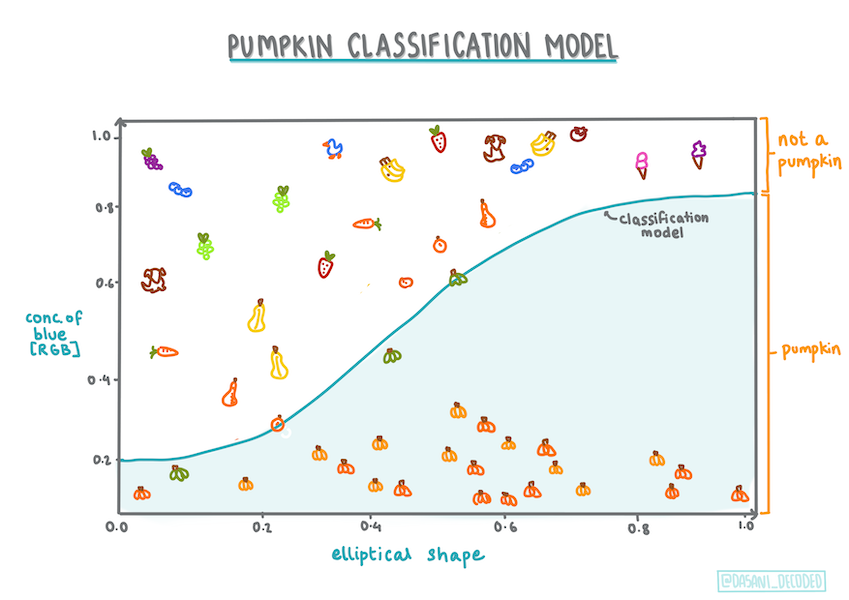
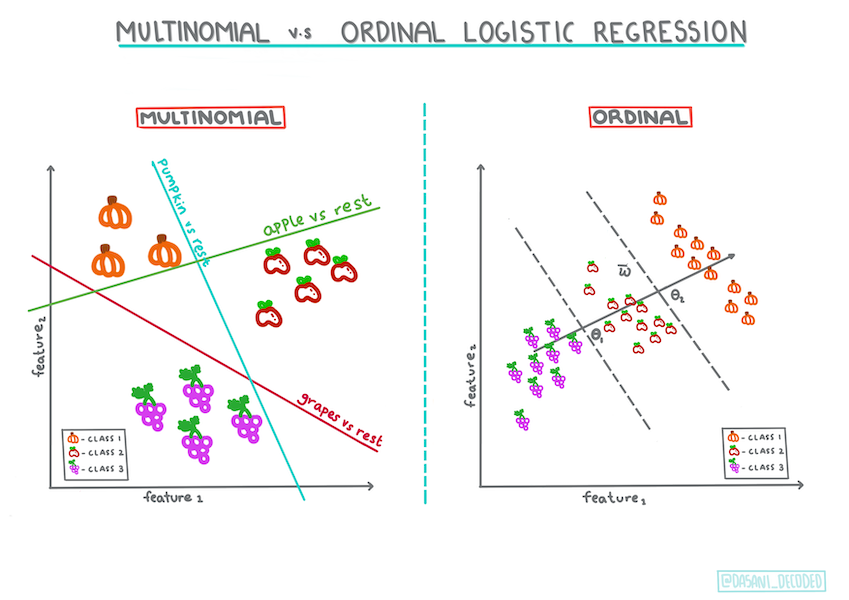
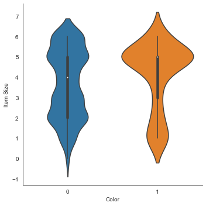

# 카테고리 예측하는 Logistic regression


> Infographic by [Dasani Madipalli](https://twitter.com/dasani_decoded)

## [강의 전 퀴즈](https://white-water-09ec41f0f.azurestaticapps.net/quiz/15/)

## 소개

기초 _classic_ ML 기술의 하나인, Regression에 대한 마지막 강의에서, Logistic Regression를 보겠습니다. 기술을 사용하면 binary categories를 예측하는 패턴을 찾습니다. 사탕 초콜릿인가요? 질병이 전염되나요? 고객이 제품을 선택하나요?

이 강의에서, 다음을 배웁니다:

- 데이터 시각화를 위한 새로운 라이브러리
- logistic regression 기술

✅ [Learn module](https://docs.microsoft.com/learn/modules/train-evaluate-classification-models?WT.mc_id=academic-15963-cxa)애서 regression의 타입에 대하여 깊게 이해해봅니다.

## 필요 조건

호박 데이터로 작업했고, 지금부터 작업할 수 있는 하나의 binary category: `Color`가 있다는 것을 알기에 충분히 익숙해졌습니다.

logistic regression 모델을 만들어서 몇가지 변수가 주어졌을 때, _호박의 (오렌지 🎃 또는 화이트 👻)색을 예측해봅니다_.

> regression에 대하여 강의를 그룹으로 묶어서 binary classification에 관련된 대화를 하는 이유는 뭘까요? logistic regression은 linear-기반이지만, [really a classification method](https://scikit-learn.org/stable/modules/linear_model.html#logistic-regression)이므로, 단지 언어적으로 편리해서 가능합니다. 다음 강의 그룹에서 데이터를 분류하는 다른 방식에 대하여 배워봅니다.

## 질문 정의하기

목적을 위하여, 바이너리로 표현합니다: 'Orange' 또는 'Not Orange'. 데이터셋에 'striped' 카테고리도 있지만 인스턴스가 약간 있으므로, 사용하지 않을 예정입니다. 데이터셋에서 null 값을 지우면 없어질겁니다.

> 🎃 재미있는 사실은, 하얀 호박을 'ghost' 호박으로 부르고 있습니다. 조각내기 쉽지 않기 때문에, 오랜지만큼 인기가 없지만 멋집니다!

## logistic regression 대하여

Logistic regression는 일부 중요한 점에서, 이전에 배운, linear regression과 차이가 있습니다.

### Binary classification

Logistic regression은 linear regression와 동일한 features를 제공하지 않습니다. 이전은 binary category ("orange or not orange")에 대한 예측을 해주는 데에 비해 후자를 예시로 들어보면, 호박의 태생과 수확 시기에 따라 _가격이 얼마나 오르는 지_ 연속 값을 예측할 수 있습니다.


> Infographic by [Dasani Madipalli](https://twitter.com/dasani_decoded)

### 다른 classifications

다항 분포와 순서수를 포함한, 다른 타입의 logistic regression이 있습니다:

- **다항분포**, 하나보다 더 많은 카테고리를 포함합니다. - "Orange, White, and Striped".
- **순서수**, 정렬된 카테고리가 포함되며, 유한한 숫자 크기 (mini,sm,med,lg,xl,xxl)로 정렬된 호박과 같이, 결과를 논리적으로 정렬하고 싶을 때 유용합니다.


> Infographic by [Dasani Madipalli](https://twitter.com/dasani_decoded)

### 여전한 linear

Regression의 타입은 모두 'category predictions'이지만, 종속 변수 (color)와 다른 독립 변수 (the rest of the dataset, like city name and size) 사이 깔끔한 linear relationship이 있을 때 잘 작동합니다. 변수를 나눌 선형성이 있는 지에 대한 아이디어를 찾는 게 좋습니다. 

### 변수에 상관 관계가 없습니다

linear regression이 많은 상관 변수에서 어떻게 작동하는지 기억나시나요? Logistic regression은 - 변수를 정렬할 필요가 없는 반대 입장입니다. 조금 약한 correlations로 데이터가 작용합니다.

### 깔끔한 데이터가 많이 필요합니다

Logistic regression은 많은 데이터로 정확한 결과를 줍니다; 작은 데이터셋은 최적화된 작업이 아니므로, 유념합시다. 

✅ logistic regression에 적당한 데이터의 타입에 대해 생각합니다.

## 연습 - tidy the data

먼저, 데이터를 조금 정리하면서, null 값을 드랍하고 일부 열만 선택합니다:

1. 다음 코드를 추가합니다:

    ```python
    from sklearn.preprocessing import LabelEncoder
    
    new_columns = ['Color','Origin','Item Size','Variety','City Name','Package']
    
    new_pumpkins = pumpkins.drop([c for c in pumpkins.columns if c not in new_columns], axis=1)
    
    new_pumpkins.dropna(inplace=True)
    
    new_pumpkins = new_pumpkins.apply(LabelEncoder().fit_transform)
    ```

    항상 새로운 데이터프레임을 살짝 볼 수 있습니다:

    ```python
    new_pumpkins.info
    ```

### 시각화 - side-by-side 그리드

호박 데이터가 있는 [starter notebook](.././notebook.ipynb)을 다시 불러오고 `Color` 포함한, 몇 변수를 데이터셋에 컨테이너화하려고 정리했습니다. 다른 라이브러리를 사용해서 노트북에서 데이터프레임을 시각화해봅니다: [Seaborn](https://seaborn.pydata.org/index.html)은, 이전에 썻던 Matplotlib을 기반으로 만들어졌습니다. 

Seaborn은 데이터를 시각화하는 깔끔한 방식들을 제공합니다. 예시로, side-by-side 그리드의 각 포인트에 대한 데이터의 분포를 비교할 수 있습니다.

1. 호박 데이터 `new_pumpkins`를 사용해서, `PairGrid`를 인스턴스화하고, `map()`을 불러서 그리드를 만듭니다:

    ```python
    import seaborn as sns
    
    g = sns.PairGrid(new_pumpkins)
    g.map(sns.scatterplot)
    ```

    

    데이터를 side-by-side로 지켜보면, 다른 열과 어떻게 관계가 이루어지는 지 볼 수 있습니다.

    ✅ scatterplot 그리드가 주어지면, 흥미있는 탐구를 구상할 수 있나요?

### swarm plot 사용하기

색상은 binary category (Orange or Not)이므로, 'categorical data'라고 부르고 '시각화에는 더 [specialized approach](https://seaborn.pydata.org/tutorial/categorical.html?highlight=bar)'가 필요합니다. 카테고리와 다른 변수 관계를 시각화하는 다른 방식도 있습니다.

Seaborn plots을 side-by-side로 변수를 시각화할 수 있습니다.

1. 값의 분포를 보여주기 위해서 'swarm' plot을 시도합니다:

    ```python
    sns.swarmplot(x="Color", y="Item Size", data=new_pumpkins)
    ```

    

### Violin plot

'violin' 타입 plot은 두개 카테고리의 데이터 배포하는 방식을 쉽게 시각화할 수 있어서 유용합니다. Violin plots은 분포가 더 'smoothly'하게 출력하기 때문에 더 작은 데이터셋에서 작동하지 않습니다.

1. 파라미터 `x=Color`, `kind="violin"` 와 `catplot()`을 호출합니다:

    ```python
    sns.catplot(x="Color", y="Item Size",
                kind="violin", data=new_pumpkins)
    ```

    

    ✅ 다른 변수를 사용해서, plot과 다른 Seaborn plots을 만들어봅니다.

이제부터 색상의 binary categories와 큰 사이즈의 그룹 사이 관계에 대한 아이디어를 낼 수 있으므로, 주어진 호박의 가능한 색상을 결정하기 위해서 logistic regression를 찾아봅니다.

> **🧮 Show Me The Math**
>
> linear regression이 값에 도달하기 위해서 자주 ordinary least squares을 사용하는 방식이 생각날까요? Logistic regression은 [sigmoid functions](https://wikipedia.org/wiki/Sigmoid_function)으로 'maximum likelihood' 컨셉에 의존합니다. plot의 'Sigmoid Function'은 'S' 모양으로 보이기도 합니다. 값을 가져와서 0과 1 사이 맵핑합니다. 이 곡선을 'logistic curve'라고 부릅니다. 공식은 이와 같습니다:
>
> 
>
> 시그모이드의 중간 지점은 x의 0 포인트에서 자기자신이며, L은 곡선의 최대 값, 그리고 k는 곡선의 기울기입니다. 만약 함수의 결과가 0.5보다 크면, 질문 레이블에서 binary choice의 클래스 '1'이 할당됩니다. 만약 아니면, '0'으로 분류됩니다.

## 모델 만들기

binary classification을 찾는 모델을 만드는 건 Scikit-learn에서 놀랍도록 간단합니다.

1. classification 모델을 사용하고 싶은 변수를 선택하고 `train_test_split()`을 불러서 훈련과 테스트할 셋으로 나눕니다:

    ```python
    from sklearn.model_selection import train_test_split
    
    Selected_features = ['Origin','Item Size','Variety','City Name','Package']
    
    X = new_pumpkins[Selected_features]
    y = new_pumpkins['Color']
    
    X_train, X_test, y_train, y_test = train_test_split(X, y, test_size=0.2, random_state=0)
    
    ```

1. 이제부터 훈련된 데이터로 `fit()`을 불러서, 모델을 훈련하고, 결과를 출력할 수 있습니다:

    ```python
    from sklearn.model_selection import train_test_split
    from sklearn.metrics import accuracy_score, classification_report 
    from sklearn.linear_model import LogisticRegression
    
    model = LogisticRegression()
    model.fit(X_train, y_train)
    predictions = model.predict(X_test)
    
    print(classification_report(y_test, predictions))
    print('Predicted labels: ', predictions)
    print('Accuracy: ', accuracy_score(y_test, predictions))
    ```

   모델의 스코어보드를 봅니다. 데이터의 100개 행만 있다는 것을 고려하면, 나쁘지 않습니다

    ```output
                       precision    recall  f1-score   support
    
               0       0.85      0.95      0.90       166
               1       0.38      0.15      0.22        33
    
        accuracy                           0.82       199
       macro avg       0.62      0.55      0.56       199
    weighted avg       0.77      0.82      0.78       199
    
    Predicted labels:  [0 0 0 0 0 0 0 0 0 0 0 0 0 0 0 0 0 0 0 0 1 0 0 0 0 0 0 0 0 0 0 0 0 1 0 0 0
     0 0 0 0 0 0 0 0 0 0 1 0 0 0 0 0 0 0 0 0 0 0 0 0 0 0 0 0 0 0 0 0 0 0 0 0 0
     1 0 0 0 0 0 0 0 0 0 0 0 0 0 0 0 0 0 0 0 0 0 0 0 0 0 0 0 1 0 0 0 0 0 0 0 1
     0 0 0 0 0 0 0 0 0 0 0 0 0 0 0 0 0 0 0 0 0 0 0 0 0 0 0 0 0 0 0 0 0 0 1 1 1
     0 0 0 0 0 0 0 0 0 0 0 0 0 0 0 0 0 0 0 0 0 0 0 0 0 0 0 0 0 0 0 0 0 0 0 0 0
     0 0 0 1 0 1 0 0 1 0 0 0 1 0]
    ```

## confusion matrix으로 더 좋게 이해하기

이 아이템을 출력해서 스코어보드 리포트 [terms](https://scikit-learn.org/stable/modules/generated/sklearn.metrics.classification_report.html?highlight=classification_report#sklearn.metrics.classification_report)를 얻을 수 있지만, 모델의 성능을 이해하는 순간 도와주는 [confusion matrix](https://scikit-learn.org/stable/modules/model_evaluation.html#confusion-matrix)를 사용하여 모델을 쉽게 이해할 수 있게 됩니다.

> 🎓 '[confusion matrix](https://wikipedia.org/wiki/Confusion_matrix)' (또는 'error matrix')는 모델의 true 대 false 로 긍정 및 부정을 나타내서, 예측의 정확도를 측정하는 테이블입니다.

1. `confusion_matrix()` 불러서, confusion metrics를 사용합니다:

    ```python
    from sklearn.metrics import confusion_matrix
    confusion_matrix(y_test, predictions)
    ```

    모델의 confusion matrix를 봅니다:

    ```output
    array([[162,   4],
           [ 33,   0]])
    ```

Scikit-learn에서, confusion matrices 행은 (axis 0) 실제 라벨이고 열은 (axis 1) 예측된 라벨입니다.

|       |   0   |   1   |
| :---: | :---: | :---: |
|   0   |  TN   |  FP   |
|   1   |  FN   |  TP   |

어떤 일이 생기나요? 모델이 'orange'와 'not-orange' 카테고리의, 두 바이너리 카테고리로 호박을 분류하게 요청받았다고 가정합니다.

- 만약 모델이 호박을 오랜지색이 아닌 것으로 예측하고 실제로 'not-orange' 카테고리에 있다면 좌측 상단에서 보여지고, true negative 라고 불립니다.
- 만약 모델이 호박을 오랜지색으로 예측하고 실제로 'not-orange' 카테고리에 있다면 좌측 하단에 보여지고, false negative 라고 불립니다.
- 만약 모델이 호박을 오랜지색이 아닌 것으로 예측하고 실제로 'orange' 카테고리에 있다면 우측 상단에 보여지고, false positive 라고 불립니다.
- 만약 모델이 호박을 오랜지색으로 예측하고 실제로 'orange' 카테고리에 있다면 우측 하단에 보여지고, true positive 라고 불립니다.

예상한 것처럼 true positives와 true negatives는 큰 숫자를 가지고 false positives와 false negatives은 낮은 숫자을 가지는 게 더 좋습니다, 모델의 성능이 더 좋다는 것을 의미합니다.

confusion matrix는 정확도와 재현율에 얼마나 관련있나요? classification 리포트에 정확도와 (0.83) 재현율 (0.98)으로 보여져서 출력되었습니다.

Precision = tp / (tp + fp) = 162 / (162 + 33) = 0.8307692307692308

Recall = tp / (tp + fn) = 162 / (162 + 4) = 0.9759036144578314

✅ Q: confusion matrix에 따르면, 모델은 어떻게 되나요? A: 나쁘지 않습니다; true positives의 많은 숫자뿐만 아니라 몇 false negatives도 있습니다.

confusion matrix TP/TN 과 FP/FN의 맵핑으로 미리 본 용어에 대하여 다시 봅니다:

🎓 정밀도: TP/(TP + FP) 검색된 인스턴스 중 관련된 인스턴스의 비율 (예시. 잘 라벨링된 라벨)

🎓 재현율: TP/(TP + FN) 라벨링이 잘 되었는 지 상관없이, 검색한 관련된 인스턴스의 비율

🎓 f1-score: (2 * precision * recall)/(precision + recall) 정밀도와 재현율의 가중치 평균은, 최고 1과 최저 0

🎓 Support: 검색된 각 라벨의 발생 수

🎓 정확도: (TP + TN)/(TP + TN + FP + FN) 샘플에서 정확한 예측이 이루어진 라벨의 백분율

🎓 Macro Avg: 라벨 불균형을 고려하지 않고, 각 라벨의 가중치가 없는 평균 지표를 계산합니다.

🎓 Weighted Avg: (각 라벨의 true 인스턴스 수) 지원에 따라 가중치를 할당해서 라벨 불균형을 고려해보고, 각 라벨의 평균 지표를 계산합니다.

✅ 만약 모델이 false negatives의 숫자를 줄어들게 하려면 어떤 지표를 봐야할 지 생각할 수 있나요?

## 모델의 ROC 곡선 시각화

나쁜 모델은 아닙니다; 정확도가 80% 범위라서 이상적으로 주어진 변수의 셋에서 호박의 색을 예측할 때 사용할 수 있습니다.

'ROC' 스코어라는 것을 보려면 더 시각화해봅니다:

```python
from sklearn.metrics import roc_curve, roc_auc_score

y_scores = model.predict_proba(X_test)
# calculate ROC curve
fpr, tpr, thresholds = roc_curve(y_test, y_scores[:,1])
sns.lineplot([0, 1], [0, 1])
sns.lineplot(fpr, tpr)
```

Seaborn을 다시 사용해서, 모델의 [Receiving Operating Characteristic](https://scikit-learn.org/stable/auto_examples/model_selection/plot_roc.html?highlight=roc) 또는 ROC를 plot합니다. ROC 곡선은 classifier의 아웃풋을 true 대 false positives 관점에서 보려고 수시로 사용됩니다. "ROC curves typically feature true positive rate on the Y axis, and false positive rate on the X axis." 따라서, 곡선의 경사도와 중간 포인트 라인과 곡선 사이 공간이 중요합니다; 라인 위로 빠르게 지나는 곡선을 원합니다. 이 케이스에서, 시작해야 할 false positives가 있고, 라인이 적당하게 계속 이어집니다:


마지막으로, Scikit-learn의 [`roc_auc_score` API](https://scikit-learn.org/stable/modules/generated/sklearn.metrics.roc_auc_score.html?highlight=roc_auc#sklearn.metrics.roc_auc_score)를 사용해서 실제 'Area Under the Curve' (AUC)를 계산합니다:

```python
auc = roc_auc_score(y_test,y_scores[:,1])
print(auc)
```
결과는 `0.6976998904709748`입니다. AUC 범위가 0부터 1까지 주어지면, 100% 예측하는 정확한 모델의 AUC가 1이므로, 큰 스코어를 원하게 됩니다. 이 케이스는, 모델이 _의외로 좋습니다_.

classifications에 대한 이후 강의에서, 모델의 스코어를 개선하기 위하여 반복하는 방식을 배울 예정입니다. 하지만 지금은, 축하합니다! regression 강의를 완료했습니다!

---
## 🚀 도전

logistic regression과 관련해서 풀어야할 내용이 더 있습니다! 하지만 배우기 좋은 방식은 실험입니다. 이런 분석에 적당한 데이터셋을 찾아서 모델을 만듭니다. 무엇을 배우나요? 팁: 흥미로운 데이터셋으로 [Kaggle](https://www.kaggle.com/search?q=logistic+regression+datasets)에서 시도해보세요.

## [강의 후 퀴즈](https://white-water-09ec41f0f.azurestaticapps.net/quiz/16/)

## 검토 & 자기주도 학습

logistic regression을 사용하는 약간의 실용적 사용에 대한 [this paper from Stanford](https://web.stanford.edu/~jurafsky/slp3/5.pdf)의 처음 몇 페이지를 읽어봅니다. 연구했던 regression 작업 중에서 하나 또는 그 외 타입에 적당한 작업을 생각해봅니다. 어떤게 더 잘 작동하나요?

## 과제 

[Retrying this regression](../assignment.md)
