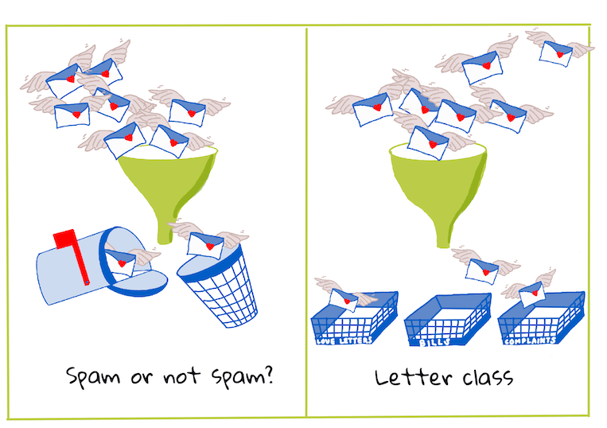

# 对分类方法的介绍

在这四节课程中，你将会学习机器学习中一个基本的重点 - _分类_. 我们会在关于亚洲和印度的神奇的美食的数据集上尝试使用多种分类算法。希望你有点饿了。


>在学习的课程中赞叹泛亚地区的美食吧！ 图片由 [Jen Looper](https://twitter.com/jenlooper)提供

分类算法是[监督学习](https://wikipedia.org/wiki/Supervised_learning) 的一种。它与回归算法在很多方面都有相同之处。如果机器学习所有的目标都是使用数据集来预测数值或物品的名字，那么分类算法通常可以分为两类 _二元分类_ 和 _多元分类_。

[](https://youtu.be/eg8DJYwdMyg "对分类算法的介绍")

> 🎥 点击上方给的图片可以跳转到一个视频-MIT的John对分类算法的介绍

请记住：

- **线性回归**  帮助你预测变量之间的关系并对一个新的数据点会落在哪条线上做出精确的预测。因此，你可以预测 _南瓜在九月的价格和十月的价格_。
- **逻辑回归**  帮助你发现“二元范畴”：即在当前这个价格， _这个南瓜是不是橙色_？

分类方法采用多种算法来确定其他可以用来确定一个数据点的标签或类别的方法。让我们来研究一下这个数据集，看看我们能否通过观察菜肴的原料来确定它的源头。

## [课程前的小问题](https://jolly-sea-0a877260f.azurestaticapps.net/quiz/19/)

分类是机器学习研究者和数据科学家使用的一种基本方法。从基本的二元分类（这是不是一份垃圾邮件？）到复杂的图片分类和使用计算机视觉的分割技术，它都是将数据分类并提出相关问题的有效工具。



> 需要分类算法解决的二元分类和多元分类问题的对比. 信息图由[Jen Looper](https://twitter.com/jenlooper)提供

在开始清洗数据、数据可视化和调整数据以适应机器学习的任务前，让我们来了解一下多种可用来数据分类的机器学习方法。

派生自[统计数学](https://wikipedia.org/wiki/Statistical_classification)，分类算法使用经典的机器学习的一些特征，比如通过'吸烟者'、'体重'和'年龄'来推断 _罹患某种疾病的可能性_。作为一个与你刚刚实践过的回归算法很相似的监督学习算法，你的数据是被标记过的并且算法通过采集这些标签来进行分类和预测并进行输出。

✅ 花一点时间来想象一下一个关于菜肴的数据集。一个多元分类的模型应该能回答什么问题？一个二元分类的模型又应该能回答什么？如果你想确定一个给定的菜肴是否会用到葫芦巴（一种植物，种子用来调味）该怎么做？如果你想知道给你一个装满了八角茴香、花椰菜和辣根的购物袋你能否做出一道代表性的印度菜又该怎么做？

[](https://youtu.be/GuTeDbaNoEU "疯狂的神秘篮子")

> 🎥 点击图像观看视频。整个'Chopped'节目的前提都是建立在神秘的篮子上，在这个节目中厨师必须利用随机给定的食材做菜。可见一个机器学习模型能起到不小的作用

## 初见-分类器

我们关于这个菜肴数据集想要提出的问题其实是一个 **多元问题**，因为我们有很多潜在的具有代表性的菜肴。给定一系列食材数据，数据能够符合这些类别中的哪一类？

Scikit-learn项目提供多种对数据进行分类的算法，你需要根据问题的具体类型来进行选择。在下两节课程中你会学到这些算法中的几个。

## 练习 - 清洗并平衡你的数据

在你开始进行这个项目前的第一个上手的任务就是清洗和 **平衡**你的数据来得到更好的结果。从当前目录的根目录中的 _nodebook.ipynb_ 开始。

第一个需要安装的东西是 [imblearn](https://imbalanced-learn.org/stable/)这是一个Scikit-learn项目中的一个包，它可以让你更好的平衡数据 (关于这个任务你很快你就会学到更多)。

1. 安装 `imblearn`, 运行命令 `pip install`:

    ```python
    pip install imblearn
    ```

1. 为了导入和可视化数据你需要导入下面的这些包, 你还需要从`imblearn`导入`SMOTE`

    ```python
    import pandas as pd
    import matplotlib.pyplot as plt
    import matplotlib as mpl
    import numpy as np
    from imblearn.over_sampling import SMOTE
    ```

    现在你已经准备好导入数据了。

1. 下一项任务是导入数据:

    ```python
    df  = pd.read_csv('../data/cuisines.csv')
    ```

   使用函数 `read_csv()` 会读取csv文件的内容 _cusines.csv_ 并将内容放置在 变量`df`中。
   
1. 检查数据的形状是否正确:

    ```python
    df.head()
    ```

   前五行输出应该是这样的:

    ```output
    |     | Unnamed: 0 | cuisine | almond | angelica | anise | anise_seed | apple | apple_brandy | apricot | armagnac | ... | whiskey | white_bread | white_wine | whole_grain_wheat_flour | wine | wood | yam | yeast | yogurt | zucchini |
    | --- | ---------- | ------- | ------ | -------- | ----- | ---------- | ----- | ------------ | ------- | -------- | --- | ------- | ----------- | ---------- | ----------------------- | ---- | ---- | --- | ----- | ------ | -------- |
    | 0   | 65         | indian  | 0      | 0        | 0     | 0          | 0     | 0            | 0       | 0        | ... | 0       | 0           | 0          | 0                       | 0    | 0    | 0   | 0     | 0      | 0        |
    | 1   | 66         | indian  | 1      | 0        | 0     | 0          | 0     | 0            | 0       | 0        | ... | 0       | 0           | 0          | 0                       | 0    | 0    | 0   | 0     | 0      | 0        |
    | 2   | 67         | indian  | 0      | 0        | 0     | 0          | 0     | 0            | 0       | 0        | ... | 0       | 0           | 0          | 0                       | 0    | 0    | 0   | 0     | 0      | 0        |
    | 3   | 68         | indian  | 0      | 0        | 0     | 0          | 0     | 0            | 0       | 0        | ... | 0       | 0           | 0          | 0                       | 0    | 0    | 0   | 0     | 0      | 0        |
    | 4   | 69         | indian  | 0      | 0        | 0     | 0          | 0     | 0            | 0       | 0        | ... | 0       | 0           | 0          | 0                       | 0    | 0    | 0   | 0     | 1      | 0        |
    ```

1. 调用函数 `info()` 可以获得有关这个数据集的信息:

    ```python
    df.info()
    ```

    Your out resembles:

    ```output
    <class 'pandas.core.frame.DataFrame'>
    RangeIndex: 2448 entries, 0 to 2447
    Columns: 385 entries, Unnamed: 0 to zucchini
    dtypes: int64(384), object(1)
    memory usage: 7.2+ MB
    ```

    ## 练习 - 了解这些菜肴

现在任务变得更有趣了，让我们来探索如何将数据分配给各个菜肴

1. 调用函数 `barh()`可以绘制出数据的条形图:

    ```python
    df.cuisine.value_counts().plot.barh()
    ```

    

    这里有有限的一些菜肴，但是数据的分配是不平均的。但是你可以修正这一现象！在这样做之前再稍微探索一下。

1. 找出对于每个菜肴有多少数据是有效的并将其打印出来:

    ```python
    thai_df = df[(df.cuisine == "thai")]
    japanese_df = df[(df.cuisine == "japanese")]
    chinese_df = df[(df.cuisine == "chinese")]
    indian_df = df[(df.cuisine == "indian")]
    korean_df = df[(df.cuisine == "korean")]
    
    print(f'thai df: {thai_df.shape}')
    print(f'japanese df: {japanese_df.shape}')
    print(f'chinese df: {chinese_df.shape}')
    print(f'indian df: {indian_df.shape}')
    print(f'korean df: {korean_df.shape}')
    ```

    输出应该是这样的 :

    ```output
    thai df: (289, 385)
    japanese df: (320, 385)
    chinese df: (442, 385)
    indian df: (598, 385)
    korean df: (799, 385)
    ```
## 探索有关食材的内容

现在你可以在数据中探索的更深一点并了解每道菜肴的代表性食材。你需要将反复出现的、容易造成混淆的数据清理出去，那么让我们来学习解决这个问题。

1. 在Python中创建一个函数 `create_ingredient_df()` 来创建一个食材的数据帧。这个函数会去掉数据中无用的列并按食材的数量进行分类。

    ```python
    def create_ingredient_df(df):
        ingredient_df = df.T.drop(['cuisine','Unnamed: 0']).sum(axis=1).to_frame('value')
        ingredient_df = ingredient_df[(ingredient_df.T != 0).any()]
        ingredient_df = ingredient_df.sort_values(by='value', ascending=False,
        inplace=False)
        return ingredient_df
    ```
现在你可以使用这个函数来得到理想的每道菜肴最重要的10种食材。

1. 调用函数 `create_ingredient_df()` 然后通过函数`barh()`来绘制图像:

    ```python
    thai_ingredient_df = create_ingredient_df(thai_df)
    thai_ingredient_df.head(10).plot.barh()
    ```

    

1. 对日本的数据进行相同的操作:

    ```python
    japanese_ingredient_df = create_ingredient_df(japanese_df)
    japanese_ingredient_df.head(10).plot.barh()
    ```

    

1. 现在处理中国的数据:

    ```python
    chinese_ingredient_df = create_ingredient_df(chinese_df)
    chinese_ingredient_df.head(10).plot.barh()
    ```

    

1. 绘制印度食材的数据:

    ```python
    indian_ingredient_df = create_ingredient_df(indian_df)
    indian_ingredient_df.head(10).plot.barh()
    ```

    

1. 最后，绘制韩国的食材的数据:

    ```python
    korean_ingredient_df = create_ingredient_df(korean_df)
    korean_ingredient_df.head(10).plot.barh()
    ```

    

1. 现在，去除在不同的菜肴间最普遍的容易造成混乱的食材，调用函数 `drop()`: 

   大家都喜欢米饭、大蒜和生姜

    ```python
    feature_df= df.drop(['cuisine','Unnamed: 0','rice','garlic','ginger'], axis=1)
    labels_df = df.cuisine #.unique()
    feature_df.head()
    ```

## 平衡数据集

现在你已经清理过数据集了, 使用 [SMOTE](https://imbalanced-learn.org/dev/references/generated/imblearn.over_sampling.SMOTE.html) - "Synthetic Minority Over-sampling Technique" - 来平衡数据集。

1. 调用函数 `fit_resample()`, 此方法通过插入数据来生成新的样本

    ```python
    oversample = SMOTE()
    transformed_feature_df, transformed_label_df = oversample.fit_resample(feature_df, labels_df)
    ```

    通过对数据集的平衡，当你对数据进行分类时能够得到更好的结果。现在考虑一个二元分类的问题，如果你的数据集中的大部分数据都属于其中一个类别，那么机器学习的模型就会因为在那个类别的数据更多而判断那个类别更为常见。平衡数据能够去除不公平的数据点。

1. 现在你可以查看每个食材的标签数量:

    ```python
    print(f'new label count: {transformed_label_df.value_counts()}')
    print(f'old label count: {df.cuisine.value_counts()}')
    ```

    输出应该是这样的 :

    ```output
    new label count: korean      799
    chinese     799
    indian      799
    japanese    799
    thai        799
    Name: cuisine, dtype: int64
    old label count: korean      799
    indian      598
    chinese     442
    japanese    320
    thai        289
    Name: cuisine, dtype: int64
    ```

    现在这个数据集不仅干净、平衡而且还很“美味” ! 

1. 最后一步是保存你处理过后的平衡的数据（包括标签和特征），将其保存为一个可以被输出到文件中的数据帧。

    ```python
    transformed_df = pd.concat([transformed_label_df,transformed_feature_df],axis=1, join='outer')
    ```

1. 你可以通过调用函数 `transformed_df.head()` 和 `transformed_df.info()`再检查一下你的数据。 接下来要将数据保存以供在未来的课程中使用:

    ```python
    transformed_df.head()
    transformed_df.info()
    transformed_df.to_csv("../data/cleaned_cuisines.csv")
    ```

    这个全新的CSV文件可以在数据根目录中被找到。

---

## 🚀小练习

本项目的全部课程含有很多有趣的数据集。 探索一下 `data`文件夹，看看这里面有没有适合二元分类、多元分类算法的数据集，再想一下你对这些数据集有没有什么想问的问题。

## [课后练习](https://jolly-sea-0a877260f.azurestaticapps.net/quiz/20/)

## 回顾 & 自学

探索一下 SMOTE的API文档。思考一下它最适合于什么样的情况、它能够解决什么样的问题。

## 课后作业 

[探索一下分类方法](../assignment.md)
