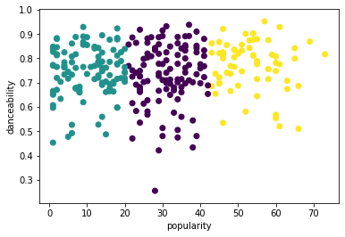

# K-Means 聚类

[](https://youtu.be/hDmNF9JG3lo "Andrew Ng explains Clustering")

> 🎥 单击上图观看视频：Andrew Ng 解释聚类

## [课前测验](https://white-water-09ec41f0f.azurestaticapps.net/quiz/29/)

在本课中，您将学习如何使用 Scikit-learn 和您之前导入的尼日利亚音乐数据集创建聚类。我们将介绍 K-Means 聚类 的基础知识。请记住，正如您在上一课中学到的，使用聚类的方法有很多种，您使用的方法取决于您的数据。我们将尝试 K-Means，因为它是最常见的聚类技术。让我们开始吧！

您将了解的术语：

- 轮廓打分
- 手肘方法
- 惯性
- 方差

## 介绍

[K-Means Clustering](https://wikipedia.org/wiki/K-means_clustering)是一种源自信号处理领域的方法。它用于使用一系列观察将数据组划分和划分为“k”个聚类。每个观察都用于对最接近其最近“平均值”或聚类中心点的给定数据点进行分组。

聚类可以可视化为[Voronoi 图](https://wikipedia.org/wiki/Voronoi_diagram)，其中包括一个点（或“种子”）及其相应的区域。


> [Jen Looper](https://twitter.com/jenlooper)作图

K-Means 聚类过程[分三步执行](https://scikit-learn.org/stable/modules/clustering.html#k-means)：

1. 该算法通过从数据集中采样来选择 k 个中心点。在此之后，它循环：
   1. 它将每个样本分配到最近的质心。
   2. 它通过取分配给先前质心的所有样本的平均值来创建新质心。
   3. 然后，它计算新旧质心之间的差异并重复直到质心稳定。

使用 K-Means 的一个缺点包括您需要建立“k”，即质心的数量。幸运的是，“肘部法则”有助于估计“k”的良好起始值。试一下吧。

## 前置条件

您将使用本课的*notebook.ipynb*文件，其中包含您在上一课中所做的数据导入和初步清理。

## 练习 - 准备

首先再看看歌曲数据。

1. 创建一个箱线图，`boxplot()`为每一列调用：

    ```python
    plt.figure(figsize=(20,20), dpi=200)
    
    plt.subplot(4,3,1)
    sns.boxplot(x = 'popularity', data = df)
    
    plt.subplot(4,3,2)
    sns.boxplot(x = 'acousticness', data = df)
    
    plt.subplot(4,3,3)
    sns.boxplot(x = 'energy', data = df)
    
    plt.subplot(4,3,4)
    sns.boxplot(x = 'instrumentalness', data = df)
    
    plt.subplot(4,3,5)
    sns.boxplot(x = 'liveness', data = df)
    
    plt.subplot(4,3,6)
    sns.boxplot(x = 'loudness', data = df)
    
    plt.subplot(4,3,7)
    sns.boxplot(x = 'speechiness', data = df)
    
    plt.subplot(4,3,8)
    sns.boxplot(x = 'tempo', data = df)
    
    plt.subplot(4,3,9)
    sns.boxplot(x = 'time_signature', data = df)
    
    plt.subplot(4,3,10)
    sns.boxplot(x = 'danceability', data = df)
    
    plt.subplot(4,3,11)
    sns.boxplot(x = 'length', data = df)
    
    plt.subplot(4,3,12)
    sns.boxplot(x = 'release_date', data = df)
    ```

    这个数据有点嘈杂：通过观察每一列作为箱线图，你可以看到异常值。

    

您可以浏览数据集并删除这些异常值，但这会使数据非常少。

1. 现在，选择您将用于聚类练习的列。选择具有相似范围的那些并将`artist_top_genre`列编码为数字类型的数据：

    ```python
    from sklearn.preprocessing import LabelEncoder
    le = LabelEncoder()
    
    X = df.loc[:, ('artist_top_genre','popularity','danceability','acousticness','loudness','energy')]
    
    y = df['artist_top_genre']
    
    X['artist_top_genre'] = le.fit_transform(X['artist_top_genre'])
    
    y = le.transform(y)
    ```

1. 现在您需要选择要定位的聚类数量。您知道我们从数据集中挖掘出 3 种歌曲流派，所以让我们尝试 3 种：

    ```python
    from sklearn.cluster import KMeans
    
    nclusters = 3 
    seed = 0
    
    km = KMeans(n_clusters=nclusters, random_state=seed)
    km.fit(X)
    
    # Predict the cluster for each data point
    
    y_cluster_kmeans = km.predict(X)
    y_cluster_kmeans
    ```

您会看到打印出的数组，其中包含数据帧每一行的预测聚类（0、1 或 2）。

1. 使用此数组计算“轮廓分数”：

    ```python
    from sklearn import metrics
    score = metrics.silhouette_score(X, y_cluster_kmeans)
    score
    ```

## 轮廓分数

寻找接近 1 的轮廓分数。该分数从 -1 到 1 不等，如果分数为 1，则该聚类密集且与其他聚类分离良好。接近 0 的值表示重叠聚类，样本非常接近相邻聚类的决策边界。[来源](https://dzone.com/articles/kmeans-silhouette-score-explained-with-python-exam)。

我们的分数是**0.53**，所以正好在中间。这表明我们的数据不是特别适合这种类型的聚类，但让我们继续。

### 练习 - 建立模型

1. 导入`KMeans`并启动聚类过程。

    ```python
    from sklearn.cluster import KMeans
    wcss = []
    
    for i in range(1, 11):
        kmeans = KMeans(n_clusters = i, init = 'k-means++', random_state = 42)
        kmeans.fit(X)
        wcss.append(kmeans.inertia_)
    
    ```

    这里有几个部分需要解释。

    > 🎓 range：这些是聚类过程的迭代

    > 🎓random_state：“确定质心初始化的随机数生成。” [来源](https://scikit-learn.org/stable/modules/generated/sklearn.cluster.KMeans.html#sklearn.cluster.KMeans)

    > 🎓WCSS：“聚类内平方和”测量聚类内所有点到聚类质心的平方平均距离。[来源](https://medium.com/@ODSC/unsupervised-learning-evaluating-clusters-bd47eed175ce)。

    > 🎓Inertia：K-Means 算法尝试选择质心以最小化“惯性”，“惯性是衡量内部相干程度的一种方法”。[来源](https://scikit-learn.org/stable/modules/clustering.html)。该值在每次迭代时附加到 wcss 变量。

    > 🎓k-means++：在[Scikit-learn 中，](https://scikit-learn.org/stable/modules/clustering.html#k-means)您可以使用“k-means++”优化，它“将质心初始化为（通常）彼此远离，导致可能比随机初始化更好的结果。

### 手肘方法

之前，您推测，因为您已经定位了 3 个歌曲genre，所以您应该选择 3 个聚类。但真的是这样吗？

1. 使用手肘方法来确认。

    ```python
    plt.figure(figsize=(10,5))
    sns.lineplot(range(1, 11), wcss,marker='o',color='red')
    plt.title('Elbow')
    plt.xlabel('Number of clusters')
    plt.ylabel('WCSS')
    plt.show()
    ```

    使用`wcss`您在上一步中构建的变量创建一个图表，显示肘部“弯曲”的位置，这表示最佳聚类数。也许**是**3！

    

## 练习 - 显示聚类

1. 再次尝试该过程，这次设置三个聚类，并将聚类显示为散点图：

    ```python
    from sklearn.cluster import KMeans
    kmeans = KMeans(n_clusters = 3)
    kmeans.fit(X)
    labels = kmeans.predict(X)
    plt.scatter(df['popularity'],df['danceability'],c = labels)
    plt.xlabel('popularity')
    plt.ylabel('danceability')
    plt.show()
    ```

1. 检查模型的准确性：

    ```python
    labels = kmeans.labels_
    
    correct_labels = sum(y == labels)
    
    print("Result: %d out of %d samples were correctly labeled." % (correct_labels, y.size))
    
    print('Accuracy score: {0:0.2f}'. format(correct_labels/float(y.size)))
    ```

    这个模型的准确性不是很好，聚类的形状给了你一个提示。

    

    这些数据太不平衡，相关性太低，列值之间的差异太大，无法很好地聚类。事实上，形成的聚类可能受到我们上面定义的三个类型类别的严重影响或扭曲。那是一个学习的过程！

    在 Scikit-learn 的文档中，你可以看到像这样的模型，聚类划分不是很好，有一个“方差”问题：

    
    
    > 图来自 Scikit-learn

## 方差

> 方差被定义为“来自均值的平方差的平均值”[源](https://www.mathsisfun.com/data/standard-deviation.html)。在这个聚类问题的上下文中，它指的是我们数据集的数量往往与平均值相差太多的数据。
>
> ✅这是考虑可以纠正此问题的所有方法的好时机。稍微调整一下数据？使用不同的列？使用不同的算法？提示：尝试[缩放数据](https://www.mygreatlearning.com/blog/learning-data-science-with-k-means-clustering/)以对其进行标准化并测试其他列。
>
> > 试试这个“[方差计算器](https://www.calculatorsoup.com/calculators/statistics/variance-calculator.php)”来更多地理解这个概念。

---

## 🚀挑战

花一些时间在这个笔记本上，调整参数。您能否通过更多地清理数据（例如，去除异常值）来提高模型的准确性？您可以使用权重为给定的数据样本赋予更多权重。你还能做些什么来创建更好的聚类？

提示：尝试缩放您的数据。笔记本中的注释代码添加了标准缩放，使数据列在范围方面更加相似。您会发现，当轮廓分数下降时，肘部图中的“扭结”变得平滑。这是因为不缩放数据可以让方差较小的数据承载更多的权重。在[这里](https://stats.stackexchange.com/questions/21222/are-mean-normalization-and-feature-scaling-needed-for-k-means-clustering/21226#21226)阅读更多关于这个问题的[信息](https://stats.stackexchange.com/questions/21222/are-mean-normalization-and-feature-scaling-needed-for-k-means-clustering/21226#21226)。

## [课后测验](https://white-water-09ec41f0f.azurestaticapps.net/quiz/30/)

## 复习与自学

看看[像这样](https://user.ceng.metu.edu.tr/~akifakkus/courses/ceng574/k-means/)的 K-Means 模拟器。您可以使用此工具来可视化样本数据点并确定其质心。您可以编辑数据的随机性、聚类数和质心数。这是否有助于您了解如何对数据进行分组？

另外，看看斯坦福大学的[k-means 讲义](https://stanford.edu/~cpiech/cs221/handouts/kmeans.html)。

## 作业

[尝试不同的聚类方法](./assignment.zh-cn.md)

