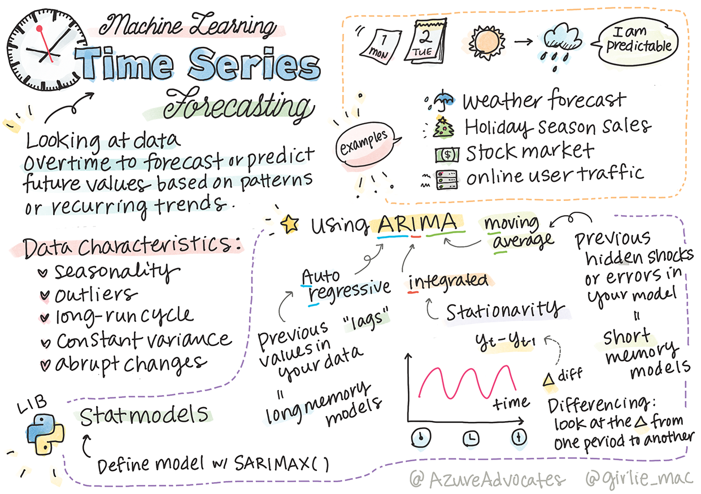
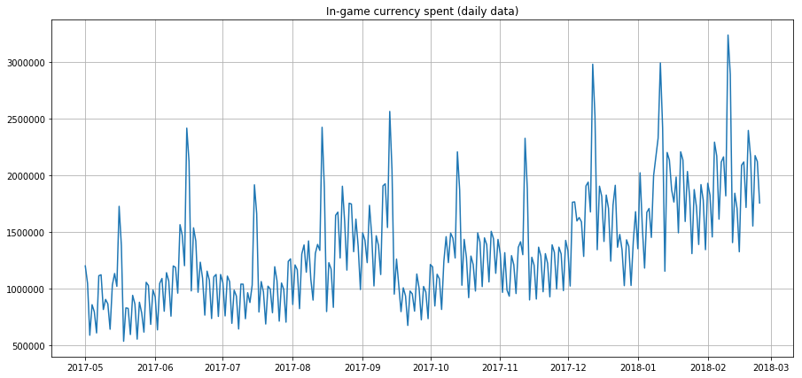

# Introduzione alla previsione delle serie temporali



> Sketchnote di [Tomomi Imura](https://www.twitter.com/girlie_mac)

In questa lezione e nella successiva si imparerà qualcosa sulla previsione delle serie temporali, una parte interessante e preziosa del repertorio di uno scienziato ML che è un po' meno conosciuta rispetto ad altri argomenti. La previsione delle serie temporali è una sorta di "sfera di cristallo": sulla base delle prestazioni passate di una variabile come il prezzo, è possibile prevederne il valore potenziale futuro.

[](https://youtu.be/cBojo1hsHiI "Introduzione alla previsione delle serie temporali")

> 🎥 Fare clic sull'immagine sopra per un video sulla previsione delle serie temporali

## [Quiz pre-lezione](https://white-water-09ec41f0f.azurestaticapps.net/quiz/41/?loc=it)

È un campo utile e interessante con un valore reale per il business, data la sua applicazione diretta a problemi di prezzi, inventario e problemi della catena di approvvigionamento. Mentre le tecniche di deep learning hanno iniziato a essere utilizzate per acquisire maggiori informazioni per prevedere meglio le prestazioni future, la previsione delle serie temporali rimane un campo ampiamente informato dalle tecniche classiche di ML.

> Un utile programma di studio delle serie temporali di Penn State può essere trovato [qui](https://online.stat.psu.edu/stat510/lesson/1)

## Introduzione

Si supponga di mantenere una serie di parchimetri intelligenti che forniscono dati su quanto spesso vengono utilizzati e per quanto nel corso del tempo.

> Se si potesse prevedere, in base alle prestazioni passate del contatore, il suo valore futuro secondo le leggi della domanda e dell'offerta?

Prevedere con precisione quando agire per raggiungere il proprio obiettivo è una sfida che potrebbe essere affrontata dalla previsione delle serie temporali. Non renderebbe le persone felici di pagare di più nei periodi di punta quando cercano un parcheggio, ma sarebbe un modo sicuro per generare entrate per pulire le strade!

Si esplorano alcuni dei tipi di algoritmi di serie temporali e si avvia un notebook per pulire e preparare alcuni dati. I dati che saranno analizzati sono tratti dal concorso di previsione GEFCom2014. Consiste in 3 anni di carico orario di elettricità e valori di temperatura tra il 2012 e il 2014. Dati i modelli storici del carico elettrico e della temperatura, è possibile prevedere i valori futuri del carico elettrico.

In questo esempio si imparerà a fare previsioni un passo avanti, utilizzando solo i dati di caricamento storici. Prima di iniziare, però, è utile capire cosa succede dietro le quinte.

## Definizioni

Quando si incontra il termine "serie temporale" è necessario comprenderne l'uso in diversi contesti.

🎓 **Serie temporali**

In matematica, "una serie temporale è una serie di punti dati indicizzati (o elencati o rappresentati graficamente) in ordine temporale". Più comunemente, una serie temporale è una sequenza presa in punti successivi equidistanti nel tempo. Un esempio di una serie temporale è il valore di chiusura giornaliero del [Dow Jones Industrial Average](https://it.wikipedia.org/wiki/Serie_storica). L'uso di grafici di serie temporali e modelli statistici si riscontra frequentemente nell'elaborazione del segnale, nelle previsioni meteorologiche, nella previsione dei terremoti e in altri campi in cui si verificano eventi e i punti dati possono essere tracciati nel tempo.

🎓 **Analisi delle serie temporali**

L'analisi delle serie temporali è l'analisi dei dati delle serie temporali sopra menzionati. I dati delle serie temporali possono assumere forme distinte, comprese le "serie temporali interrotte" che rilevano i modelli nell'evoluzione di una serie temporale prima e dopo un evento di interruzione. Il tipo di analisi necessaria per le serie temporali dipende dalla natura dei dati. I dati delle serie temporali possono assumere la forma di serie di numeri o caratteri.

L'analisi da eseguire utilizza una varietà di metodi, tra cui dominio della frequenza e dominio del tempo, lineare e non lineare e altro ancora. Per [saperne di più](https://www.itl.nist.gov/div898/handbook/pmc/section4/pmc4.htm) sui molti modi per analizzare questo tipo di dati.

🎓 **Previsione delle serie temporali**

La previsione delle serie temporali è l'uso di un modello per prevedere i valori futuri in base ai modelli visualizzati dai dati raccolti in precedenza così come si sono verificati in passato. Sebbene sia possibile utilizzare modelli di regressione per esplorare i dati delle serie temporali, con indici temporali come x variabili su un grafico, tali dati vengono analizzati al meglio utilizzando tipi speciali di modelli.

I dati delle serie temporali sono un elenco di osservazioni ordinate, a differenza dei dati che possono essere analizzati mediante regressione lineare. Il più comune è ARIMA, acronimo che sta per "Autoregressive Integrated Moving Average" (Modello autoregressivo integrato a media mobile).

[I modelli ARIMA](https://online.stat.psu.edu/stat510/lesson/1/1.1) "mettono in relazione il valore attuale di una serie con i valori passati e gli errori di previsione passati". Sono più appropriati per l'analisi dei dati nel dominio del tempo, in cui i dati sono ordinati nel tempo.

> Esistono diversi tipi di modelli ARIMA, [qui](https://people.duke.edu/~rnau/411arim.htm) si possono trovare ulteriori informazioni al riguardo e di cui si parlerà nella prossima lezione.

Nella prossima lezione, si creerà un modello ARIMA utilizzando [Serie Temporali UYnivariate](https://itl.nist.gov/div898/handbook/pmc/section4/pmc44.htm), che si concentra su una variabile che cambia il suo valore nel tempo. Un esempio di questo tipo di dati è [questo insieme di dati](https://itl.nist.gov/div898/handbook/pmc/section4/pmc4411.htm) che registra la concentrazione mensile di C02 presso l'Osservatorio di Mauna Loa:

| CO2 | YearMonth | Year | Month |
| :----: | :-------: | :---: | :---: |
| 330.62 | 1975.04 | 1975 | 1 |
| 331.40 | 1975.13 | 1975 | 2 |
| 331.87 | 1975.21 | 1975 | 3 |
| 333.18 | 1975.29 | 1975 | 4 |
| 333.92 | 1975.38 | 1975 | 5 |
| 333.43 | 1975.46 | 1975 | 6 |
| 331.85 | 1975.54 | 1975 | 7 |
| 330.01 | 1975.63 | 1975 | 8 |
| 328.51 | 1975.71 | 1975 | 9 |
| 328.41 | 1975.79 | 1975 | 10 |
| 329.25 | 1975.88 | 1975 | 11 |
| 330.97 | 1975.96 | 1975 | 12 |

✅ Identificare la variabile che cambia nel tempo in questo set di dati

## [Caratteristiche dei dati](https://online.stat.psu.edu/stat510/lesson/1/1.1) delle serie temporali da considerare

Quando si esaminano i dati delle serie temporali, è possibile notare che presentano determinate caratteristiche che è necessario prendere in considerazione e mitigare per comprenderne meglio i modelli. Se si considerano i dati delle serie temporali come potenziali produttori di un "segnale" che si desidera analizzare, queste caratteristiche possono essere considerate "rumore". Spesso sarà necessario ridurre questo "rumore" compensando alcune di queste caratteristiche utilizzando alcune tecniche statistiche.

Ecco alcuni concetti che si dovrebbe conoscere per poter lavorare con le serie temporali:

🎓 **Tendenze**

Le tendenze sono definite come aumenti e diminuzioni misurabili nel tempo. [Per saperne di più](https://machinelearningmastery.com/time-series-trends-in-python). Nel contesto delle serie temporali, si tratta di come utilizzare e, se necessario, rimuovere le tendenze dalle serie temporali.

🎓 **[Stagionalità](https://machinelearningmastery.com/time-series-seasonality-with-python/)**

La stagionalità è definita come fluttuazioni periodiche, come le vacanze estive che potrebbero influire sulle vendite, ad esempio. [Si dia un'occhiata](https://itl.nist.gov/div898/handbook/pmc/section4/pmc443.htm) a come i diversi tipi di grafici mostrano la stagionalità nei dati.

🎓 **Valori anomali**

I valori anomali sono molto lontani dalla varianza dei dati standard.

🎓 **Ciclo di lunga durata**

Indipendentemente dalla stagionalità, i dati potrebbero mostrare un ciclo di lungo periodo come una recessione economica che dura più di un anno.

🎓 **Varianza costante**

Nel tempo, alcuni dati mostrano fluttuazioni costanti, come il consumo energetico giornaliero e notturno.

🎓 **Cambiamenti improvvisi**

I dati potrebbero mostrare un cambiamento improvviso che potrebbe richiedere un'ulteriore analisi. La brusca chiusura delle attività a causa del COVID, ad esempio, ha causato cambiamenti nei dati.

✅ Ecco un [esempio di grafico della serie temporale](https://www.kaggle.com/kashnitsky/topic-9-part-1-time-series-analysis-in-python) che mostra la valuta di gioco giornaliera spesa in alcuni anni. Si riesce a identificare una delle caratteristiche sopra elencate in questi dati?



## Esercizio: iniziare con i dati sul consumo energetico

Si inizia a creare un modello di serie temporali per prevedere l'utilizzo futuro di energia dato l'utilizzo passato.

> I dati in questo esempio sono presi dal concorso di previsione GEFCom2014. Consiste in 3 anni di carico orario di elettricità e valori di temperatura tra il 2012 e il 2014.
>
> Tao Hong, Pierre Pinson, Shu Fan, Hamidreza Zareipour, Alberto Troccoli e Rob J. Hyndman, "Probabilistic energy forecasting: Global Energy Forecasting Competition 2014 and beyond", International Journal of Forecasting, vol.32, no.3, pp 896- 913, luglio-settembre 2016.

1. Nella cartella `working` di questa lezione, aprire il _file_ notebook.ipynb. Iniziare aggiungendo librerie che aiuteranno a caricare e visualizzare i dati

   ```python
   import os
   import matplotlib.pyplot as plt
   from common.utils import load_data
   %matplotlib inline
   ```

   Nota, si stanno utilizzando i file dalla cartella `common` inclusa che configura il proprio ambiente e gestisce il download dei dati.

2. Quindi, si esaminano i dati come un dataframe chiamando `load_data()` e `head()`:

   ```python
   data_dir = './data'
   energy = load_data(data_dir)[['load']]
   energy.head()
   ```

   Si può vedere che ci sono due colonne che rappresentano data e carico:

   |                     | load |
   | :-----------------: | :----: |
   | 2012-01-01 00:00:00 | 2698.0 |
   | 2012-01-01 01:00:00 | 2558.0 |
   | 2012-01-01 02:00:00 | 2444.0 |
   | 2012-01-01 03:00:00 | 2402.0 |
   | 2012-01-01 04:00:00 | 2403.0 |

3. Ora, tracciare i dati chiamando `plot()`:

   ```python
   energy.plot(y='load', subplots=True, figsize=(15, 8), fontsize=12)
   plt.xlabel('timestamp', fontsize=12)
   plt.ylabel('load', fontsize=12)
   plt.show()
   ```

   

4. Ora, tracciare la prima settimana di luglio 2014, fornendola come input per `energy` nella forma `[from date]: [to date]`:

   ```python
   energy['2014-07-01':'2014-07-07'].plot(y='load', subplots=True, figsize=(15, 8), fontsize=12)
   plt.xlabel('timestamp', fontsize=12)
   plt.ylabel('load', fontsize=12)
   plt.show()
   ```

   

   Uno stupendo grafico! Dare un'occhiata a questi grafici e vedere se si riesce a determinare una delle caratteristiche sopra elencate. Cosa si può dedurre visualizzando i dati?

Nella prossima lezione, si creerà un modello ARIMA per creare alcune previsioni.

---

## 🚀 Sfida

Fare un elenco di tutti i settori e le aree di indagine che vengono in mente che potrebbero trarre vantaggio dalla previsione delle serie temporali. Si riesce a pensare a un'applicazione di queste tecniche nelle arti? In Econometria? Ecologia? Vendita al Dettaglio? Industria? Finanza? Dove se no?

## [Quiz post-lezione](https://white-water-09ec41f0f.azurestaticapps.net/quiz/42/?loc=it)

## Revisione e Auto Apprendimento

Sebbene non si tratteranno qui, le reti neurali vengono talvolta utilizzate per migliorare i metodi classici di previsione delle serie temporali. Si legga di più su di loro [in questo articolo](https://medium.com/microsoftazure/neural-networks-for-forecasting-financial-and-economic-time-series-6aca370ff412)

## Compito

[Visualizzare altre serie temporali](assignment.it.md)
