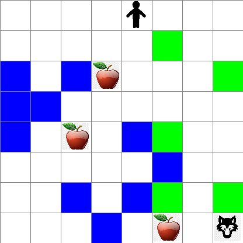

# 强化学习和 Q-Learning 介绍


> 作者 [Tomomi Imura](https://www.twitter.com/girlie_mac)

强化学习涉及三个重要概念：代理、一些状态和每个状态的一组动作。通过在指定状态下执行一个动作，代理会得到奖励。想象一下电脑游戏超级马里奥。你是马里奥，你在一个游戏关卡中，站在悬崖边上。在你上面是一枚硬币。你是马里奥，在游戏关卡里，在特定位置......这就是你的状态。向右移动一步（一个动作）会让跌下悬崖，而且会得到一个低分。然而，按下跳跃按钮会让你活下来并得分。这是一个积极的结果，它会给你一个积极、正向的分数。

通过使用强化学习和模拟器（游戏），你可以学习如何玩游戏以最大化奖励，既能够活下去还可以获得尽可能多的积分。

[](https://www.youtube.com/watch?v=lDq_en8RNOo)

> 🎥 点击上图观看 Dmitry 讨论强化学习

## [课前测验](https://gray-sand-07a10f403.1.azurestaticapps.net/quiz/45/)

## 先决条件和设置

在本课中，我们将用 Python 代码做一些试验。你应该能够在你的计算机上或云中的某个地方运行本课程中的 Jupyter Notebook 代码。

你可以打开[课本笔记本](../notebook.ipynb) 并通过学习本课进行编译、运行。

> **注意：** 如果你是从云端打开此代码，你还需要获取笔记本代码中使用的 [`rlboard.py`](../rlboard.py) 文件。将其添加到与笔记本相同的目录中。

## 介绍

在本课中，我们将探索 **[彼得与狼](https://en.wikipedia.org/wiki/Peter_and_the_Wolf)** 的世界，其灵感来自俄罗斯作曲家 [Sergei Prokofiev](https://en.wikipedia.org/wiki/Sergei_Prokofiev)的音乐童话。我们将使用**强化学习**让彼得探索他的环境，收集美味的苹果并避免遇到狼。

**强化学习**（RL）是一种学习技术，它允许我们通过运行许多实验来学习**代理**在某些**环境**中的最佳行为。这种环境中的代理应该有一些**目标**，由**奖励函数**定义。

## 环境

为简单起见，让我们将 Peter 的世界视为一个大小为 `width` x `height` 的方板，如下所示：


该板中的每个单元格可以是：

* **地面**，彼得和其他生物可以在上面行走。
* **水**，不能在上面行走。
* **树**或**草**，可以休息的地方。
* **苹果**，代表彼得希望找到用来喂饱自己的食物。
* **狼**，这是危险的，应该避免遇到。

有一个单独的 Python 模块 [`rlboard.py`](../rlboard.py)，其中包含在此环境中工作的代码。因为这段代码对于理解我们的概念并不重要，我们将导入该模块并使用它来创建示例板（代码块 1）：

```python
from rlboard import *

width, height = 8,8
m = Board(width,height)
m.randomize(seed=13)
m.plot()
```

这段代码会打印一张类似于上面的环境图片。

## 行动和策略

在我们的例子中，彼得的目标是找到苹果，同时避开狼和其他障碍物。为此，他可以四处走动，直到找到一个苹果。

因此，在任何位置，他都可以选择以下动作之一：向上、向下、向左和向右。

我们将这些动作定义为字典，并将它们映射到相应的坐标变化对。例如，向右移动 (`R`) 将对应于一对 `(1,0)`。（代码块 2）：

```python
actions = { "U" : (0,-1), "D" : (0,1), "L" : (-1,0), "R" : (1,0) }
action_idx = { a : i for i,a in enumerate(actions.keys()) }
```

综上所述，本场景的策略和目标如下：

- 我们的代理（彼得）的**策略**由一个函数定义，它返回任何给定状态下的动作。在我们的例子中，问题的状态由棋盘表示，包括玩家的当前位置。

- **目标**，强化学习的目的是学习一个好的策略，使我们能够有效地解决问题。但是，作为基准，让我们考虑称为 **随机走动** 的最简单策略。

## 随机走动

让我们首先通过实施随机走动策略来解决我们的问题。通过随机走动，我们从允许的动作中随机选择下一个动作，直到我们找到苹果（代码块 3）。

1. 使用以下代码实现随机走动：

    ```python
    def random_policy(m):
        return random.choice(list(actions))

    def walk(m,policy,start_position=None):
        n = 0 # number of steps
        # set initial position
        if start_position:
            m.human = start_position
        else:
            m.random_start()
        while True:
            if m.at() == Board.Cell.apple:
                return n # success!
            if m.at() in [Board.Cell.wolf, Board.Cell.water]:
                return -1 # eaten by wolf or drowned
            while True:
                a = actions[policy(m)]
                new_pos = m.move_pos(m.human,a)
                if m.is_valid(new_pos) and m.at(new_pos)!=Board.Cell.water:
                    m.move(a) # do the actual move
                    break
            n+=1

	walk(m,random_policy)
    ```

    对 `walk` 的调用应返回相应路径的长度，该长度可能因每次运行而不同。 

1. 多次运行该实验（例如 100 次），并打印结果统计信息（代码块 4）：

    ```python
    def print_statistics(policy):
        s,w,n = 0,0,0
        for _ in range(100):
            z = walk(m,policy)
            if z<0:
                w+=1
            else:
                s += z
                n += 1
        print(f"Average path length = {s/n}, eaten by wolf: {w} times")

	print_statistics(random_policy)
   ```

    请注意，一条路径的平均长度约为 30-40 步，考虑到到最近苹果的平均距离约为 5-6 步，这一数字相当大。

    你还可以看到 Peter 在随机走动过程中的运动情况：

    

## 奖励函数

为了使我们的策略更加智能，我们需要了解哪些动作比其他动作 "更好"。为此，我们需要定义我们的目标。

可以根据**奖励函数**来定义目标，该函数将为每个状态返回一些分数值。数字越大，奖励函数越好。（代码块 5）

```python
move_reward = -0.1
goal_reward = 10
end_reward = -10

def reward(m,pos=None):
    pos = pos 或 m.human
    if not m.is_valid(pos):
        return end_reward
    x = m.at(pos)
    if x==Board.Cell.water or x == Board.Cell.wolf：
        return end_reward
    if x==Board.Cell.apple：
        return goal_reward
    return move_reward
```

关于奖励函数的一个有趣的事情是，在大多数情况下，*我们只在游戏结束时才得到实质性的奖励*。这意味着我们的算法应该以某种方式记住最终导致积极奖励的"好"步骤，并增加它们的重要性。同样，所有导致不良结果的举动都应该被阻拦。

## Q-Learning

我们将在这里讨论的一种叫做 **Q-Learning** 的算法。在该算法中，策略由称为 **Q-Table** 的函数（或数据结构）定义。它记录了给定状态下每个动作的"优点"。

之所以称为 Q-Table，是因为表格或多维数组通常表示起来很方便。由于我们的棋盘尺寸为 "width"x"height"，我们可以使用形状为 "width"x"height"x"len(actions) 的 numpy 数组来表示 Q-Table：（代码块6）

```python
Q = np.ones((width,height,len(actions)),dtype=np.float)*1.0/len(actions)
```

请注意，我们将 Q-Table 的所有值初始化为一个相等的值，在我们的例子中为 "-0.25"。这对应于"随机走动"策略，因为每个状态中的所有移动都同样好。我们可以将 Q-Table 传递给 `plot` 函数，以便在板上可视化表格：`m.plot(Q)`。


在每个单元格的中心有一个"箭头"，表示首选的移动方向。由于所有方向都相等，因此显示一个点。

现在我们需要运行这个程序，探索我们的环境，并学习更好的 Q-Table 值分布，这将使我们能够更快地找到通往苹果的路径。

## Q-Learning 的本质：贝尔曼方程

一旦我们开始移动，每个动作都会有相应的奖励，即理论上我们可以根据最高的即时奖励来选择下一个动作。但是，在大多数情况，此举不会实现我们到达苹果的目标，因此我们无法立即决定哪个方向更好。

> 请记住，重要的不是直接结果，而是我们将在模拟结束时获得的最终结果。

为了解释这种延迟奖励，我们需要使用**[动态规划](https://en.wikipedia.org/wiki/Dynamic_programming)** 的原则，它允许我们递归地思考问题。

假设我们现在处于状态 *s*，并且我们想要移动到下一个状态 *s'*。通过这样做，我们将收到由奖励函数定义的即时奖励 *r(s,a)*，以及一些未来的奖励。如果我们假设我们的 Q-Table 正确反映了每个动作的“吸引力”，那么在状态 *s'* 我们将选择对应于 *Q(s',a')* 最大值的动作 *a*。因此，我们可以在状态 *s* 获得的最佳未来奖励将被定义为 `max`<sub>a'</sub>*Q(s',a')*（这里的最大值是在状态 *s'* 时所有可能的动作 *a'* 上计算的)。

这给出了 **Bellman 公式**，用于计算状态 *s* 的 Q-Table 值，给定动作 *a*：


这里 γ 是所谓的**折扣因子**，它决定了你应该在多大程度上更喜欢当前的奖励而不是未来的奖励，反之亦然。

## 学习算法

鉴于上面的等式，我们现在可以为我们的学习算法编写伪代码：

* 用相同的数字为所有状态和动作初始化 Q-Table Q
* 设置学习率α ← 1
* 多次重复模拟
   1. 随机位置开始
   1. 重复
        1. 在状态 *s* 选择一个动作 *a*
        2.通过移动到新状态 *s'* 来执行动作
        3.如果我们遇到游戏结束的情况，或者总奖励太少——退出模拟  
        4. 计算新状态下的奖励 *r*
        5. 根据 Bellman 方程更新 Q-Function： *Q(s,a)* ← *(1-α)Q(s,a)+α(r+γ max<sub>a'</sub>Q( s',a'))*
        6. *s* ← *s'*
        7. 更新总奖励并减少 α。

## 利用与探索

在上面的算法中，我们没有指定在步骤 2.1 中我们应该如何选择一个动作。如果我们随机选择动作，我们会随机**探索**环境，我们很可能会经常死亡以及探索我们通常不会去的区域。另一种方法是**利用**我们已经知道的 Q-Table 值，从而在状态 *s* 选择最佳动作（具有更高的 Q-Table 值）。然而，这将阻止我们探索其他状态，而且我们可能找不到最佳解决方案。

因此，最好的方法是在探索和开发之间取得平衡。这可以通过选择状态 *s* 的动作来完成，概率与 Q 表中的值成正比。一开始，当 Q-Table 值都相同时，它将对应于随机选择，但是随着我们对环境的了解越来越多，我们将更有可能遵循最佳路线，同时允许智能体偶尔选择未探索的路径。

## Python 实现

我们现在准备实现学习算法。在我们这样做之前，我们还需要一些函数来将 Q-Table 中的任意数字转换为相应动作的概率向量。

1. 创建一个函数 `probs()`：

    ```python
    def probs(v,eps=1e-4):
        v = vv.min()+eps
        v = v/v.sum()
        return v
    ```

    我们向原始向量添加了一些 `eps`，以避免在初始情况下被 0 除，此时向量的所有分量都相同。

通过 5000 次实验运行他们的学习算法，也称为 **epochs**：（代码块 8）

```python
   for epoch in range(5000):
    
        # Pick initial point
        m.random_start()
        
        # Start travelling
        n=0
        cum_reward = 0
        while True:
            x,y = m.human
            v = probs(Q[x,y])
            a = random.choices(list(actions),weights=v)[0]
            dpos = actions[a]
            m.move(dpos,check_correctness=False) # we allow player to move outside the board, which terminates episode
            r = reward(m)
            cum_reward += r
            if r==end_reward or cum_reward < -1000:
                lpath.append(n)
                break
            alpha = np.exp(-n / 10e5)
            gamma = 0.5
            ai = action_idx[a]
            Q[x,y,ai] = (1 - alpha) * Q[x,y,ai] + alpha * (r + gamma * Q[x+dpos[0], y+dpos[1]].max())
            n+=1
```

执行此算法后，应使用定义每个步骤不同动作的吸引力的值更新 Q-Table 。我们可以尝试通过在每个单元格上绘制一个向量来可视化 Q-Table，该向量将指向所需的移动方向。为简单起见，我们画一个小圆圈而不是箭头。


## 检查策略

由于 Q-Table 列出了每个状态下每个动作的"吸引力"，因此很容易使用它来定义我们世界中的高效导航。在最简单的情况下，我们可以选择最高 Q-Table 值对应的 action：（代码块9）

```python
def qpolicy_strict(m):
    x,y = m.human
    v = probs(Q[x,y])
    a = list(actions)[np.argmax(v)]
    return a

walk(m,qpolicy_strict)
```

> 如果你多次尝试上面的代码，你可能会注意到它有时会"挂起"，你需要按笔记本中的 STOP 按钮来中断它。发生这种情况是因为可能存在两种状态在最佳 Q 值方面"指向"彼此的情况，在这种情况下，代理最终会在这些状态之间无限期地移动。

## 🚀挑战

> **任务 1：** 修改 `walk` 函数，将路径的最大长度限制为一定的步数（比如 100），并时不时地观察上面的代码返回值。

> **任务 2：** 修改 `walk` 函数，使其不会回到之前已经去过的地方。这将防止 `walk` 循环，但是，代理仍然可能最终"被困"在它无法逃脱的位置。

## 导航

更好的导航策略是我们在训练期间使用的，它结合了利用和探索。在这个策略中，我们将以一定的概率选择每个动作，与 Q-Table 中的值成比例。这种策略可能仍会导致代理返回到它已经探索过的位置，但是，正如你从下面的代码中看到的，它会导致到达所需位置的平均路径非常短（请记住，`print_statistics` 运行模拟100次）：（代码块10）

```python
def qpolicy(m):
    x,y = m.human
    v = probs(Q[x,y])
    a = random.choices(list(actions),weights=v)[0]
    return a

print_statistics(qpolicy)
```

运行此代码后，你应该获得比以前小得多的平均路径长度，范围为 3-6。

## 调查学习过程

正如我们已经提到的，学习过程是探索和探索有关问题空间结构的知识之间的平衡。我们已经看到学习的结果（帮助代理找到到达目标的短路径的能力）有所改善，但观察平均路径长度在学习过程中的表现也很有趣：


学习内容可以概括为：

- **平均路径长度增加**。我们在这里看到的是，起初，平均路径长度增加。这可能是因为当我们对环境一无所知时，我们很可能会陷入糟糕的状态，水或狼。随着我们学习更多并开始使用这些知识，我们可以更长时间地探索环境，但我们仍然不知道苹果在哪里。

- **随着我们了解更多，路径长度减少**。一旦我们学习得足够多，代理就更容易实现目标，路径长度开始减少。然而，我们仍然对探索持开放态度，因此我们经常偏离最佳路径，并探索新的选择，使路径比最佳路径更长。

- **长度突然增加**。我们在这张图上还观察到，在某个时刻，长度突然增加。这表明该过程的随机性，我们可以在某个时候通过用新值覆盖 Q-Table 系数来"破坏" Q-Table 系数。理想情况下，这应该通过降低学习率来最小化（例如，在训练结束时，我们只调整 Q-Table 很小的一个小值）。

总的来说，重要的是要记住学习过程的成功和质量在很大程度上取决于参数，例如学习率、学习率衰减和折扣因子。这些通常称为**超参数**，以区别于我们在训练期间优化的**参数**（例如，Q-Table 系数）。寻找最佳超参数值的过程称为**超参数优化**，它值得一个单独的话题来介绍。

## [课后测验](https://gray-sand-07a10f403.1.azurestaticapps.net/quiz/46/)

## 作业[一个更真实的世界](assignment.zh-cn.md)
